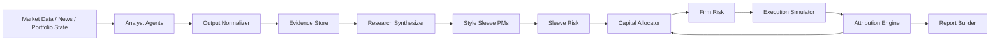

# AI 智能投研系统模拟工作台 PRD / 产品设计文档 v1

**产品名称**：AI 智能投研系统模拟工作台  
**英文名**：AI Investment Research Simulation Workspace  
**版本**：PRD v1.0  
**日期**：2026-05-19  
**文档状态**：First Draft  
**产品定位**：Research & Decision-Support Workspace / Paper Portfolio Governance Product  
**主线范围**：不接真实交易；不将 virattt v2 未完成量化栈纳入 v1 主线；v2 仅作为 Appendix / Discussion 方向保留  

---

## 目录

1. [文档目的](#01-文档目的)
2. [产品概述](#02-产品概述)
3. [问题与机会](#03-问题与机会)
4. [目标用户与核心场景](#04-目标用户与核心场景)
5. [产品目标与非目标](#05-产品目标与非目标)
6. [MVP 范围](#06-mvp-范围)
7. [用户旅程](#07-用户旅程)
8. [功能需求](#08-功能需求)
9. [核心数据模型](#09-核心数据模型)
10. [交互与页面设计](#10-交互与页面设计)
11. [系统架构与模块边界](#11-系统架构与模块边界)
12. [指标体系](#12-指标体系)
13. [权限、审计与合规边界](#13-权限审计与合规边界)
14. [实施计划](#14-实施计划)
15. [风险与缓解](#15-风险与缓解)
16. [开放问题](#16-开放问题)
17. [Appendix：v2 讨论](#appendixv2-讨论)

---

## 01. 文档目的

本文档用于定义 **AI 智能投研系统模拟工作台 v1** 的产品范围、用户场景、核心功能、数据模型、页面设计、指标体系和实施计划。

该 PRD 服务于两个目标：

1. **产品设计目标**：将开源多 Agent 投资 demo 重构为一个证据优先、可解释、可治理、可复盘的投研模拟工作台。
2. **作品集表达目标**：展示从开源项目拆解、问题定义、用户场景、产品架构、功能需求、指标假设到风险边界的完整 PM 思考过程。

---

## 02. 产品概述

### 2.1 产品一句话

> AI 智能投研系统模拟工作台帮助研究员和 PM 助理把多 Agent 分析结果转化为可追溯证据、可比较提案、可审批风控决策和可复盘研究 memo。

### 2.2 产品定位

本产品是：

```text
AI 投研模拟工作台 / 研究与决策支持系统 / Paper Portfolio Governance Product
```

本产品不是：

```text
自动交易系统 / 投资顾问 / 真实下单系统 / 保证收益的策略平台
```

### 2.3 核心价值

| 用户痛点 | 产品价值 |
|---|---|
| 多 Agent 输出分散，难以判断依据 | Evidence Board 标准化整理证据 |
| 最终结果过早收敛为单一 buy/sell/hold | 多 Style Sleeve PM 输出可比较 proposal |
| 风控逻辑存在但不可见 | Two-layer Risk Cockpit 让风控可视化、可解释 |
| 预算分配缺少依据 | Capital Allocator 展示 score、budget、haircut reason |
| 建议生成后无法复盘 | Attribution Dashboard 追踪 analyst / sleeve / risk flag 表现 |
| 研究结果难以分享 | Report Builder 导出 Markdown / PDF investment memo |

---

## 03. 问题与机会

### 3.1 当前问题

现有开源 AI hedge fund 项目大致是：

```text
Selected Analysts → Risk Management Agent → Portfolio Manager → Final Decision
```

这个结构适合 demo，但存在四个产品短板：

1. **信号过早收敛**：所有 analyst 输出最终都被压缩到单一 Portfolio Manager。
2. **缺少 Evidence Layer**：agent 输出缺少统一证据 schema，难以追溯。
3. **风控没有产品化**：risk manager 更像后台 position limit，而不是审批工作流。
4. **缺少复盘闭环**：无法把结果反馈给 analyst reliability、sleeve budget 和 allocator。

### 3.2 产品机会

将系统从：

```text
AI Trading Demo
```

升级为：

```text
AI Research-to-Governance Workspace
```

也就是把原来的“AI 帮我给交易建议”转为“AI 帮我组织研究证据、比较观点、进行模拟风控审批并生成可复盘 memo”。

---

## 04. 目标用户与核心场景

### 4.1 目标用户

| 用户类型 | 角色描述 | 核心需求 |
|---|---|---|
| Buy-side 研究员 | 负责分析公司、行业、主题机会 | 快速汇总多维证据，生成 bull/bear/key risks |
| PM 助理 | 协助 PM 比较投资提案和准备投委会材料 | 横向比较 sleeve proposals，查看风险审批理由 |
| 研究工程师 | 负责把 agent 输出结构化、产品化 | 需要 schema、日志、模块边界和可测试流程 |
| 独立研究者 | 自己维护 watchlist 和 paper portfolio | 需要低成本、本地化、可导出的研究工作台 |

### 4.2 核心场景

| 场景 | 用户目标 | 成功体验 |
|---|---|---|
| 研究启动 | 输入 ticker 或研究问题，快速获取初步判断 | 90 秒内看到 Evidence Board 和 summary |
| 多风格评审 | 比较 Value / Growth / Macro / Contrarian 的不同观点 | 一页看到 4 个 proposal 的 action、thesis、risk |
| 投前风控 | 判断 proposal 合并后是否超出组合约束 | Risk Cockpit 给出 approve / scale / block 和 reason log |
| 预算分配 | 将风险预算分配给不同 sleeve | Allocator 展示 score、budget、haircut reason |
| 投后复盘 | 评估 agent、sleeve、risk flag 是否可靠 | Attribution Dashboard 展示 outcome 和 reliability |
| 报告导出 | 形成投研 memo 供沟通和作品集展示 | 一键导出 Markdown / PDF memo |

---

## 05. 产品目标与非目标

### 5.1 产品目标

#### G1：建立可追溯 Evidence Layer

将多个 agent 的输出标准化为 Evidence Item，使用户能看到每个结论的来源、置信度、风险标记和时间戳。

#### G2：将单一 PM 决策升级为多 Sleeve Proposal Review

通过 Value / Growth / Macro / Contrarian 四个 Style Sleeve PM，让用户看到不同投资风格对同一证据的不同解释。

#### G3：将风控产品化为 Two-layer Risk Cockpit

区分 Sleeve-level Risk 和 Firm-level Risk，将 approve / scale / block 变成可解释、可审计的流程。

#### G4：用 Capital Allocator 连接 proposal quality 与预算分配

通过可解释 scoring rule 分配模拟风险预算，并展示 haircut reason。

#### G5：建立 Attribution Loop

将 proposal、risk decision、allocation 和 simulated outcome 关联，更新 analyst reliability 与 sleeve scorecard。

#### G6：输出可分享研究 memo

通过 Report Builder 导出 Markdown / PDF research memo，作为用户沟通材料和作品集展示物。

### 5.2 非目标

v1 不做：

- 不接真实券商交易；
- 不提供个性化投资建议；
- 不承诺收益；
- 不做高频交易；
- 不把 virattt v2 未完成量化栈作为主线依赖；
- 不在 MVP 阶段实现完全去中心化多 PM 竞价市场。

---

## 06. MVP 范围

### 6.1 MVP 核心闭环

```text
Research Task
  → Analyst Outputs
  → Evidence Board
  → Research Synthesizer
  → Sleeve Proposals
  → Sleeve Risk
  → Capital Allocator
  → Firm Risk
  → Execution Simulator
  → Attribution
  → Report Builder
```

### 6.2 P0 / P1 / P2 范围

| 优先级 | 功能 | 说明 |
|---|---|---|
| P0 | Research Workspace | 输入研究问题、触发分析、查看 evidence |
| P0 | Evidence Board | 标准化展示证据、来源、置信度、risk flags |
| P0 | Research Synthesizer | 生成 bull case / bear case / key risks |
| P0 | Sleeve Proposal Panel | 4 个风格化 proposal，对比观点分歧 |
| P0 | Two-layer Risk Cockpit | sleeve risk + firm risk + reason log |
| P0 | Report Builder | 导出 Markdown memo |
| P1 | Capital Allocator | 可解释预算分配和 haircut reason |
| P1 | Execution Simulator | paper execution，不接真实交易 |
| P1 | Attribution Dashboard | proposal outcome 和 analyst reliability |
| P1 | PDF Export | 从 Markdown memo 导出 PDF |
| P2 | Multi-user Review | 多用户批注、审批流 |
| P2 | Advanced Stress Test | 情景压力测试 |
| P2 | Decentralized Proposal Market | 作为实验方向，不纳入 v1 |
| P2 | v2 Quant Validation Layer | 作为 appendix / future discussion |

---

## 07. 用户旅程

### 7.1 端到端流程

```mermaid
flowchart LR
    A[输入研究问题] --> B[生成多 Agent 分析]
    B --> C[标准化 Evidence Board]
    C --> D[Research Synthesizer]
    D --> E[4 个 Sleeve Proposals]
    E --> F[Sleeve-level Risk]
    F --> G[Capital Allocator]
    G --> H[Firm-level Risk]
    H --> I[Paper Execution]
    I --> J[Attribution]
    J --> K[Report Builder]
```



### 7.2 用户故事

#### User Story 1：研究员启动研究

作为研究员，我希望输入一个 ticker 和研究 horizon 后，系统能生成多维证据和初步 summary，这样我可以快速判断是否值得深入研究。

**验收标准**

- 输入 ticker 和 horizon 后可触发 research task；
- 90 秒内返回第一版 Evidence Board；
- 每条 evidence 有 type、source、confidence、risk flags。

#### User Story 2：PM 助理比较风格化提案

作为 PM 助理，我希望看到不同风格 PM 对同一标的的 proposal，这样我可以准备更完整的投委会材料。

**验收标准**

- 同一 ticker 至少生成 4 个 sleeve proposals；
- 每个 proposal 显示 action、target exposure、thesis、confidence、supporting evidence；
- 用户可点击 proposal 查看引用 evidence。

#### User Story 3：PM 查看风控审批

作为 PM，我希望系统告诉我 proposal 合并后是否违反组合风险约束，并解释 approve / scale / block 原因。

**验收标准**

- 每个 proposal 先经过 sleeve-level risk；
- 所有 approved proposal 进入 firm-level aggregation；
- 每次 scale / block 必须有 reason code。

#### User Story 4：研究团队复盘结果

作为研究团队负责人，我希望看到 analyst、sleeve、risk flag 的历史表现，这样可以更新下一轮研究权重和预算。

**验收标准**

- 每个 proposal 都能关联 simulated outcome；
- Dashboard 展示 analyst reliability、sleeve hit rate、proposal returns；
- attribution 结果可反馈给 allocator。

---

## 08. 功能需求

### 8.1 Research Workspace

| 字段 | 内容 |
|---|---|
| 功能目标 | 输入研究问题并启动多 Agent 分析 |
| 用户 | 研究员 / PM 助理 |
| 优先级 | P0 |

#### 功能点

- 输入 ticker / watchlist / research question；
- 选择 horizon：short / medium / long；
- 选择 analyst agent 组合；
- 显示 task status：draft / running / completed / in review；
- 显示输出区域：Evidence Board、Summary、Sleeve Proposals。

#### 验收标准

- 用户能创建 research task；
- 系统能展示 task progress；
- 任务完成后能进入 Evidence Board。

---

### 8.2 Evidence Board

| 字段 | 内容 |
|---|---|
| 功能目标 | 将 agent 输出转化为可追溯证据 |
| 用户 | 研究员 / 研究工程师 |
| 优先级 | P0 |

#### 功能点

- 展示 evidence list；
- 支持按 evidence_type 筛选；
- 支持按 confidence 排序；
- 支持显示 risk flags；
- 支持 source refs；
- 支持 evidence → proposal 的引用关系。

#### 验收标准

- 每条 evidence 至少包含 ticker、agent_name、evidence_type、signal、confidence、summary、risk_flags、source_refs、timestamp；
- 80% 以上 analyst output 可映射到 EvidenceItem；
- 用户能在 2 次点击内查看 supporting evidence。

---

### 8.3 Research Synthesizer

| 字段 | 内容 |
|---|---|
| 功能目标 | 聚合证据并生成结构化研究摘要 |
| 用户 | 研究员 / PM 助理 |
| 优先级 | P0 |

#### 功能点

- 识别 consensus / disagreement；
- 生成 bull case；
- 生成 bear case；
- 生成 key risks；
- 标记低置信度或证据冲突；
- 将 summary 输出给 Sleeve PM。

#### 验收标准

- 每个 research task 至少生成 bull case、bear case、key risks；
- Summary 中的关键结论能回链到 evidence；
- 用户能区分“AI summary”和“原始 evidence”。

---

### 8.4 Sleeve Proposal Panel

| 字段 | 内容 |
|---|---|
| 功能目标 | 让不同投资风格形成可比较 proposal |
| 用户 | PM 助理 / PM |
| 优先级 | P0 |

#### 功能点

- Value Sleeve PM；
- Growth Sleeve PM；
- Macro Sleeve PM；
- Contrarian Sleeve PM；
- Proposal comparison table；
- Supporting evidence drill-down；
- Proposal status：draft / risk checked / approved / scaled / blocked。

#### Proposal 字段

- action：add / reduce / hold / avoid；
- target_exposure；
- thesis；
- confidence；
- expected_horizon；
- supporting_evidence_ids；
- key_risks；
- sleeve_name。

#### 验收标准

- 同一 research task 至少生成 4 个 sleeve proposals；
- 每个 proposal 至少引用 1 条 evidence；
- 用户能横向比较四个 proposal。

---

### 8.5 Two-layer Risk Cockpit

| 字段 | 内容 |
|---|---|
| 功能目标 | 将风险管理转化为可视化审批流程 |
| 用户 | PM / 风控 / PM 助理 |
| 优先级 | P0 |

#### Sleeve-level Risk

检查：

- single-name exposure limit；
- sleeve budget limit；
- volatility flag；
- correlation flag；
- style drift flag；
- holding period constraint。

输出：

- pass / scale / block；
- approved_exposure；
- reason_codes；
- risk_metrics。

#### Firm-level Risk

检查：

- aggregate gross exposure；
- net exposure；
- sector concentration；
- beta / factor exposure；
- liquidity risk；
- cross-sleeve crowding。

输出：

- final approve / scale / block；
- global reason log；
- risk envelope status；
- override ticket。

#### 验收标准

- 每个 proposal 都有 sleeve risk record；
- 所有 passed proposals 都进入 firm-level risk；
- 每次 scale / block 都必须展示 reason code；
- Risk Cockpit 至少覆盖 gross、net、sector、correlation/crowding、liquidity 五类风险。

---

### 8.6 Capital Allocator

| 字段 | 内容 |
|---|---|
| 功能目标 | 对不同 sleeve 分配模拟风险预算 |
| 用户 | PM / PM 助理 |
| 优先级 | P1 |

#### v1 规则

```text
sleeve_score
= 0.30 * expected_edge
+ 0.20 * thesis_confidence
+ 0.15 * analyst_reliability
+ 0.15 * diversification_bonus
- 0.10 * recent_drawdown_penalty
- 0.10 * crowding_penalty

raw_budget = softmax(sleeve_score / temperature) * total_risk_budget
final_budget = apply_firm_caps(raw_budget)
```

#### 功能点

- 显示 sleeve_score；
- 显示 score breakdown；
- 显示 budget recommendation；
- 显示 firm caps 后的 final budget；
- 显示 haircut reason；
- 记录 allocation history。

#### 验收标准

- 每个 allocation decision 可解释；
- 用户能看到 raw_budget 与 final_budget 差异；
- allocator decision 可以被 firm risk 覆盖或缩放。

---

### 8.7 Execution Simulator

| 字段 | 内容 |
|---|---|
| 功能目标 | 将 approved proposal 转成 paper portfolio event |
| 用户 | 研究员 / PM 助理 |
| 优先级 | P1 |

#### 功能点

- 模拟订单生成；
- 模拟 fill；
- paper position update；
- execution log；
- 不接真实交易接口。

#### 验收标准

- 每个 approved proposal 都有 simulated execution event；
- execution event 可追溯到 proposal、risk decision、allocation decision；
- 页面明确展示 Simulation Only。

---

### 8.8 Attribution Dashboard

| 字段 | 内容 |
|---|---|
| 功能目标 | 复盘 agent、sleeve、risk flag 和 allocation 表现 |
| 用户 | 研究团队负责人 / PM / 研究工程师 |
| 优先级 | P1 |

#### 功能点

- analyst reliability score；
- sleeve hit rate；
- proposal return；
- risk-adjusted performance；
- risk flag outcome；
- veto / haircut outcome；
- allocation adjustment suggestion。

#### 验收标准

- 每个 proposal 都有 outcome record；
- 每个 analyst 可计算 reliability score；
- 每个 sleeve 有 scorecard；
- attribution 结果能反馈给下一轮 allocator。

---

### 8.9 Report Builder

| 字段 | 内容 |
|---|---|
| 功能目标 | 生成可分享 investment memo |
| 用户 | 研究员 / PM 助理 |
| 优先级 | P0 |

#### 功能点

- 一键生成 Markdown memo；
- 支持 PDF 导出；
- 支持用户编辑；
- 支持插入 Evidence Board；
- 支持插入 Sleeve Proposal Summary；
- 支持插入 Risk Decision 和 Allocation Recommendation；
- 标注 AI generated / human edited。

#### Memo 模板

```md
# Investment Research Memo

## 1. Research Question

## 2. Executive Summary

## 3. Evidence Board

## 4. Bull Case

## 5. Bear Case

## 6. Sleeve Proposals

## 7. Risk Decision

## 8. Allocation Recommendation

## 9. Final Notes

## 10. Disclaimer
```

#### 验收标准

- 报告导出成功率 ≥ 95%；
- 报告中可追溯 evidence；
- 报告明确标注 Simulation Only / Not Investment Advice。

---

## 09. 核心数据模型

### 9.1 ResearchTask

```json
{
  "task_id": "TASK-20260519-001",
  "created_by": "user_001",
  "ticker": "NVDA",
  "research_question": "Analyze NVDA over the next 3-6 months.",
  "horizon": "medium",
  "selected_agents": ["fundamentals", "valuation", "sentiment", "technical", "news"],
  "status": "completed",
  "created_at": "2026-05-19T09:00:00-07:00"
}
```

### 9.2 EvidenceItem

```json
{
  "evidence_id": "EV-NVDA-001",
  "task_id": "TASK-20260519-001",
  "ticker": "NVDA",
  "agent_name": "fundamentals_analyst",
  "evidence_type": "fundamental",
  "signal": "bullish",
  "confidence": 0.82,
  "horizon": "medium",
  "summary": "Revenue growth remains strong while margin expansion continues.",
  "risk_flags": ["high_valuation", "crowded_trade"],
  "source_refs": ["fundamentals", "news", "market_data"],
  "created_at": "2026-05-19T09:30:00-07:00"
}
```

### 9.3 ResearchSummary

```json
{
  "summary_id": "SUM-NVDA-001",
  "task_id": "TASK-20260519-001",
  "bull_case": ["Growth remains durable", "Margins are expanding"],
  "bear_case": ["Valuation is elevated", "Trade is crowded"],
  "key_risks": ["high_valuation", "crowded_trade", "macro_rate_risk"],
  "consensus": "moderately bullish",
  "disagreements": ["valuation vs growth"],
  "evidence_ids": ["EV-NVDA-001", "EV-NVDA-002"]
}
```

### 9.4 SleeveProposal

```json
{
  "proposal_id": "PROP-NVDA-GROWTH-001",
  "task_id": "TASK-20260519-001",
  "ticker": "NVDA",
  "sleeve": "growth",
  "action": "add",
  "target_exposure": 0.04,
  "confidence": 0.81,
  "expected_horizon": "3-6 months",
  "thesis": "Growth durability remains strong despite valuation risk.",
  "supporting_evidence_ids": ["EV-NVDA-001", "EV-NVDA-004"],
  "key_risks": ["high_valuation", "crowded_trade"],
  "status": "risk_checked"
}
```

### 9.5 RiskDecision

```json
{
  "risk_decision_id": "RISK-PROP-NVDA-GROWTH-001",
  "proposal_id": "PROP-NVDA-GROWTH-001",
  "risk_layer": "firm",
  "decision": "scale",
  "original_exposure": 0.04,
  "approved_exposure": 0.025,
  "reason_codes": ["tech_sector_cap_near_limit", "crowding_risk_amber"],
  "metrics": {
    "gross_exposure": 0.78,
    "net_exposure": 0.42,
    "sector_tech_exposure": 0.28,
    "liquidity_score": 0.74
  }
}
```

### 9.6 AllocationDecision

```json
{
  "allocation_id": "ALLOC-20260519-001",
  "task_id": "TASK-20260519-001",
  "sleeve_scores": {
    "value": 0.58,
    "growth": 0.81,
    "macro": 0.62,
    "contrarian": 0.70
  },
  "raw_budget": {
    "value": 0.12,
    "growth": 0.18,
    "macro": 0.10,
    "contrarian": 0.08
  },
  "final_budget": {
    "value": 0.12,
    "growth": 0.14,
    "macro": 0.10,
    "contrarian": 0.08
  },
  "haircut_reasons": {
    "growth": "scaled due to sector concentration"
  }
}
```

### 9.7 AttributionRecord

```json
{
  "attribution_id": "ATTR-PROP-NVDA-GROWTH-001",
  "proposal_id": "PROP-NVDA-GROWTH-001",
  "ticker": "NVDA",
  "sleeve": "growth",
  "holding_period_days": 20,
  "simulated_return": 0.032,
  "risk_adjusted_return": 0.021,
  "risk_flags_triggered": ["crowded_trade"],
  "analyst_contribution": {
    "fundamentals_analyst": 0.45,
    "sentiment_analyst": 0.20,
    "valuation_analyst": -0.10
  },
  "outcome_label": "positive"
}
```

---

## 10. 交互与页面设计

### 10.1 页面列表

| 页面 | 路径 | 主要功能 | 优先级 |
|---|---|---|---|
| Dashboard | `/dashboard` | watchlist、recent tasks、alerts | P1 |
| Research Workspace | `/workspace/:task_id` | 输入研究问题、查看 evidence、proposal | P0 |
| Evidence Board | `/workspace/:task_id/evidence` | evidence 列表、筛选、引用关系 | P0 |
| Sleeve Proposal Panel | `/workspace/:task_id/proposals` | 4 个 sleeve proposal 对比 | P0 |
| Risk Cockpit | `/risk/:task_id` | sleeve risk、firm risk、approval log | P0 |
| Capital Allocator | `/allocator/:task_id` | score、budget、haircut | P1 |
| Attribution Dashboard | `/attribution` | outcome、reliability、scorecard | P1 |
| Report Builder | `/reports/:task_id` | memo 编辑和导出 | P0 |
| Settings | `/settings` | data provider、model、risk limits | P1 |

### 10.2 Research Workspace 低保真

```text
┌──────────────────────────────────────────────────────────────────────┐
│ Logo   Workspace   Risk   Attribution   Reports   Settings          │
├───────────────┬───────────────────────────────┬──────────────────────┤
│ 左侧导航       │ 中央研究画布                  │ 右侧证据/约束面板       │
│ - Watchlist   │ [输入研究问题 / 选择 ticker]   │ Evidence Board         │
│ - Tasks       │ [Horizon] [Run Research]       │ - 原始信号             │
│ - Sleeves     │                               │ - 数据来源             │
│ - Reports     │ [Research Synthesizer 输出]    │ - 时间戳 / 置信度      │
│               │                               │ Risk Constraints       │
│               │ [Value / Growth / Macro /     │ - Sleeve cap           │
│               │  Contrarian 四个 sleeve 卡片] │ - Firm net/gross       │
│               │                               │ - Sector / factor cap  │
│               │ [送审] [生成 Memo]             │                      │
└───────────────┴───────────────────────────────┴──────────────────────┘
```

### 10.3 Risk Cockpit 低保真

```text
┌──────────────────────────────────────────────────────────────────────┐
│ Firm Risk Committee                                                  │
├──────────────────────┬───────────────────────────┬───────────────────┤
│ Sleeve Proposals     │ Capital Allocator         │ Approval Log       │
│ - Value: +0%         │ score_value = 0.58        │ 10:12  approved    │
│ - Growth: +4%        │ score_growth = 0.81       │ 10:13  haircut     │
│ - Macro:  +0%        │ score_macro  = 0.62       │ 10:14  vetoed      │
│ - Contrarian: -2%    │ score_contra = 0.70       │                   │
│                      │                           │                   │
│ Exposure Overview    │ Risk Envelope             │ Export             │
│ - Gross / Net        │ - Beta cap                │ [PDF] [MD] [CSV]   │
│ - Sector heatmap     │ - Liquidity cap           │                   │
│ - Correlation map    │ - Crowding cap            │                   │
└──────────────────────┴───────────────────────────┴───────────────────┘
```

---

## 11. 系统架构与模块边界

### 11.1 总体架构



### 11.2 模块设计

| 模块 | 类型 | 说明 |
|---|---|---|
| Agent Orchestrator | Backend | 调用不同 analyst agents |
| Output Normalizer | Backend | 将 agent 输出映射到 EvidenceItem |
| Evidence Store | Data | 存储 evidence、source、risk flags |
| Research Synthesizer | Backend / LLM | 聚合证据、生成 summary |
| Sleeve PM Agents | Backend / LLM | 生成风格化 proposal |
| Risk Engine | Backend | 运行 sleeve risk 与 firm risk checks |
| Allocator Engine | Backend | 生成 sleeve score 和 budget recommendation |
| Execution Simulator | Backend | 生成 paper execution events |
| Attribution Engine | Backend | 计算 outcome、reliability、scorecard |
| Report Builder | Frontend + Backend | 生成 Markdown / PDF memo |

### 11.3 设计约束

- 所有 LLM 生成内容必须可追溯到 EvidenceItem 或明确标记为 synthesis；
- 所有 proposal 必须引用 supporting evidence；
- 所有 approved proposal 必须经过 risk check；
- 所有 scale / block 必须有 reason log；
- v1 不触发真实交易；
- 所有报告必须包含 disclaimer。

---

## 12. 指标体系

### 12.1 产品指标

| 指标 | 定义 | v1 目标 |
|---|---|---|
| Time to First Evidence | 用户输入 ticker 到看到第一版 evidence summary | < 90 秒 |
| Evidence Traceability Rate | 关键结论可回溯到 evidence 的比例 | ≥ 80% |
| Proposal Coverage | 每个 task 生成 sleeve proposal 数量 | ≥ 4 |
| Proposal Evidence Coverage | proposal 引用 supporting evidence 的比例 | ≥ 80% |
| Report Export Success Rate | memo 成功导出率 | ≥ 95% |
| Risk Decision Coverage | proposal 有 risk decision log 的比例 | 100% |

### 12.2 质量指标

| 指标 | 定义 | v1 目标 |
|---|---|---|
| Schema Mapping Coverage | analyst 输出能映射到 EvidenceItem 的比例 | ≥ 80% |
| Unsupported Recommendation Rate | 明显无 evidence 支持的 recommendation 比例 | ≤ 10% |
| Proposal-Evidence Consistency | proposal 与 supporting evidence 的一致性评分 | ≥ 0.8 |
| Missing Critical Field Rate | evidence 缺少核心字段的比例 | ≤ 20% |

### 12.3 风控指标

| 指标 | 定义 | v1 目标 |
|---|---|---|
| Sleeve Risk Check Coverage | 每个 proposal 是否经过 sleeve risk | 100% |
| Firm Risk Check Coverage | approved proposal 是否进入 firm risk | 100% |
| Reason Log Coverage | scale / block 是否有 reason code | 100% |
| Risk Categories Covered | firm-level risk 覆盖类别数量 | ≥ 5 |

### 12.4 工程与 LLM 观测指标

| 指标 | 定义 | v1 目标 |
|---|---|---|
| Core Flow Smoke Test Pass Rate | 核心路径测试通过率 | ≥ 95% |
| LLM Latency P95 | research summary / proposal 生成延迟 | 待基准测量 |
| Cost per Research Task | 单次 research task LLM 成本 | 待基准测量 |
| Failure Retry Success Rate | 失败重试后成功率 | ≥ 90% |
| Trace Coverage | 关键 LLM 调用被 trace 的比例 | ≥ 90% |

---

## 13. 权限、审计与合规边界

### 13.1 权限设计 v1

| 角色 | 权限 |
|---|---|
| Researcher | 创建 task、查看 evidence、生成 memo |
| PM Assistant | 查看 proposals、提交 risk review、编辑 memo |
| PM | 审阅 risk decision、批准模拟 proposal |
| Admin | 配置模型、数据源、risk limits |

### 13.2 审计日志

系统需要记录：

- task 创建与参数；
- agent 输出；
- evidence normalizer 结果；
- proposal 生成；
- risk decision；
- allocation decision；
- simulated execution；
- memo 导出；
- user edit / override。

### 13.3 合规边界文案

所有页面底部应展示：

```text
This system is for research simulation and educational purposes only. 
It does not provide investment advice and does not execute real trades.
All outputs require human review.
```

中文版本：

```text
本系统仅用于研究模拟和教育展示，不构成投资建议，不执行真实交易。所有输出均需人工复核。
```

---

## 14. 实施计划

### Phase 0：Product Framing & Baseline Audit

**周期**：1 周  
**目标**：完成项目拆解、用户定位、问题定义、before/after 结构图。

**交付物**

- Case Study outline；
- baseline workflow；
- target user definition；
- PRD v1；
- redesign architecture。

---

### Phase 1：Evidence Layer + Workspace MVP

**周期**：1–2 周  
**目标**：把 agent 输出标准化为 EvidenceItem，并完成 Research Workspace 原型。

**交付物**

- Evidence schema；
- output normalizer；
- Evidence Board；
- Research Synthesizer；
- basic report draft。

---

### Phase 2：Sleeve PM + Proposal Review

**周期**：1–2 周  
**目标**：实现 4 个 Style Sleeve PM 和 proposal comparison view。

**交付物**

- Sleeve PM prompt / role definition；
- Proposal Card；
- Sleeve Proposal Panel；
- supporting evidence link。

---

### Phase 3：Risk Cockpit + Allocator

**周期**：2 周  
**目标**：实现 two-layer risk 和规则版 capital allocator。

**交付物**

- Sleeve Risk Check；
- Firm Risk Cockpit；
- reason log；
- allocator score breakdown；
- budget recommendation。

---

### Phase 4：Attribution + Report Builder

**周期**：1–2 周  
**目标**：形成闭环，并完成作品集可展示版本。

**交付物**

- Attribution Dashboard；
- analyst reliability；
- sleeve scorecard；
- Markdown / PDF export；
- demo video script。

---

## 15. 风险与缓解

| 风险 | 影响 | 缓解方式 |
|---|---|---|
| LLM 生成内容幻觉 | 用户误信错误结论 | Evidence first、source refs、human review |
| Agent 输出格式不一致 | 无法稳定展示 Evidence Board | output normalizer、schema validation |
| 风控过于复杂 | MVP 难以交付 | 先覆盖 5 类核心 firm risk |
| Allocator 显得拍脑袋 | 预算分配可信度低 | 显示权重、score breakdown、允许配置 |
| UI 工程量过大 | 延误作品集交付 | 优先做 3 个核心页面：Workspace、Risk Cockpit、Report Builder |
| v2 干扰主线 | Case 变成未完成技术整合 | v2 只放 appendix discussion |
| 合规误读 | 被认为提供投资建议 | 明确 Simulation Only / Not Investment Advice |

---

## 16. 开放问题

1. v1 是否需要真实数据源，还是优先使用 mock / demo dataset？
2. Evidence confidence 是由 agent 自评，还是由规则/验证层调整？
3. Sleeve PM 是否使用固定四类，还是允许用户自定义？
4. Firm Risk 的默认限制参数如何设定？
5. Attribution 的观察周期如何定义：日、周、月？
6. Report Builder 第一版只导出 Markdown，还是同时支持 PDF？
7. 是否需要支持团队协作审批流？
8. 是否在未来接入 v2 quant stack 作为验证层？

---

## Appendix：v2 讨论

本 PRD v1 暂不纳入 virattt v2，原因是：

- v2 在原仓库中尚未完成；
- v1 主线已经能独立形成完整产品闭环；
- 作品集第一版应避免把“AI 投研工作台 redesign”和“量化交易栈重构”混成两个主题。

建议在作品集最后以 Discussion 形式保留：

```text
Future Discussion:
如果 v2 的 quant stack 成熟，可以将其作为 Quant Validation Layer 接入现有 AI Research Workspace。
届时系统可升级为：
LLM Research Layer → Quant Validation Layer → Portfolio Governance Layer。
```

v1 仍优先交付：

```text
Evidence → Sleeve Proposal → Two-layer Risk → Capital Allocation → Attribution → Report
```

