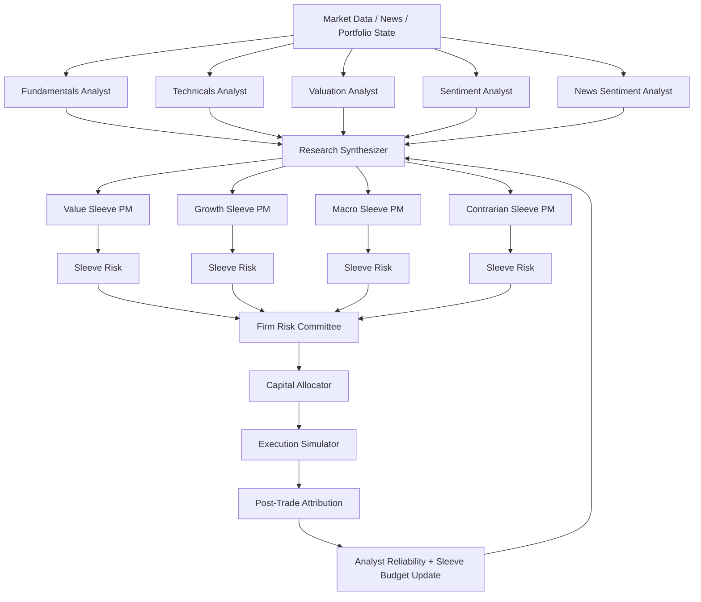

> 从开源 AI Hedge Fund Demo 到证据优先、可治理、可复盘的 AI 投研模拟工作台

**文档类型**：PM 作品集 Case Study / 开源项目拆解与产品重设计  
**版本**：v1.0  
**日期**：2026-05-19  
**项目定位**：AI 投研模拟工作台 / Research & Decision-Support Workspace  
**主线范围**：暂不纳入 virattt v2 未完成量化栈；v2 仅作为 Appendix / Discussion 方向保留  

---

## TL;DR

`ai-hedge-fund` 是一个具有强传播性的开源多 Agent 投资决策原型。它通过多个投资风格 agent、基本面分析、估值分析、情绪分析、技术分析、风险管理和组合管理模块，对股票形成多角度判断，并输出交易建议。

但从产品视角看，它更像一个“能演示的 AI 交易 PoC”，而不是一个可被真实研究员、Portfolio Manager(PM) 助理或研究工程师使用的投研工作台。核心问题不是 agent 数量不够，而是：

> **证据 → 提案 → 预算分配 → 风控审批 → 复盘归因** 之间没有被产品化为一个可解释、可治理、可复盘的组织流程。

因此，本次 redesign 的方向不是继续添加更多 analyst agent，也不是把系统包装成自动交易器，而是将其重构为一个 **AI 智能投研系统模拟工作台**：

- LLM / Agent 负责生成和整理研究证据，而不是直接替用户做交易决定；
- Research Synthesizer 将多 Agent 输出转化为标准化 Evidence；
- 多个 Style Sleeve PM 基于同一组 Evidence 形成可比较提案；
- Two-layer Risk 将风控拆分为 Sleeve-level 与 Firm-level；
- Capital Allocator 根据 proposal quality、风险和历史表现分配模拟预算；
- Attribution Dashboard 将 proposal、risk flag、allocation 与后续结果关联，形成复盘闭环；
- Report Builder 将完整研究流程导出为可分享的 Markdown / PDF investment memo。

最终目标是把一个“多 Agent 交易演示项目”重设计为一个 **证据优先、可解释、可治理、可复盘的 AI 投研模拟工作台**。

---

## 目录

1. [项目背景](#01-项目背景)
2. [问题定义](#02-问题定义)
3. [现状诊断](#03-现状诊断)
4. [用户与场景](#04-用户与场景)
5. [重新设计](#05-重新设计)
6. [信息架构与核心页面](#06-信息架构与核心页面)
7. [架构与实现](#07-架构与实现)
8. [MVP 功能需求](#08-mvp-功能需求)
9. [实施计划与指标假设](#09-实施计划与指标假设)
10. [作品集呈现方式](#10-作品集呈现方式)
11. [商业化与风险边界](#11-商业化与风险边界)
12. [反思](#12-反思)
13. [Appendix：关于 virattt v2 的讨论](#appendix关于-virattt-v2-的讨论)

---

## 01. 项目背景

### 1.1 原项目是什么

`ai-hedge-fund` 是一个开源的多 Agent 投资决策原型。它将 “AI Agent + Hedge Fund + 投资大师风格” 结合起来，让多个 agent 从不同角度分析股票，并由风险管理与组合管理模块输出最终交易建议。

它具备几个明显优势：

- 主题有记忆点：AI hedge fund 天然具备传播性；
- 多 Agent 叙事清晰：不同投资风格和分析维度共同参与决策；
- 工程形态较完整：具备 CLI、Web App、Backtester、多 Agent orchestration 等基础；
- 适合二次产品化：从 PoC 转向投研工作台，有明确的用户价值提升空间。

### 1.2 为什么值得做 redesign

原项目最大的吸引力是“AI 能不能像一个 hedge fund 一样工作”。但如果要把它作为 PM 作品集案例，单纯强调“很多 agent 会给出买入/卖出建议”是不够的。

真实投研用户关心的不是一个黑箱答案，而是：

- 这个观点来自哪些证据？
- 哪些 agent 支持，哪些 agent 反对？
- 不同投资风格会如何解读同一组证据？
- 这笔 proposal 在当前组合里是否违反风险约束？
- 如果最终表现不好，是 analyst 判断错了、PM proposal 错了、风控没拦住，还是 allocator 预算分错了？

这说明 redesign 的核心不应该是“加更多 agent”，而是把系统从 **Signal Generator** 升级为 **Research-to-Governance Workflow**。

### 1.3 新产品一句话定位

> **AI 智能投研系统模拟工作台：帮助研究员和 PM 助理把多 Agent 分析结果转化为可追溯证据、可比较提案、可审批风险决策和可复盘投资 memo。**

---

## 02. 问题定义

### 2.1 核心问题

当前系统的问题不是 analyst agent 不够多，而是：

> **证据 → 提案 → 预算分配 → 风控审批 → 复盘归因** 之间没有被产品化为一个可解释的组织流程。

现有工作流大致可以抽象为：

```text
Selected Analysts → Risk Management Agent → Portfolio Manager → Final Decision
```

这个结构适合 demo，但作为投研产品会暴露四个核心问题。

---

### 2.2 问题 1：信号过早收敛到单一 Portfolio Manager

多个 analyst agent 输出不同角度的判断，但最终被汇总到一个单一 Portfolio Manager，由它统一做最终动作选择。

这会导致：

- 用户无法清楚比较不同投资风格之间的分歧；
- 上游 agent 的证据被压缩成 signal / confidence；
- 研究过程在最终答案中被弱化，难以复盘；
- 最终决策更像一次性 LLM 输出，而不是组织化投研流程。

---

### 2.3 问题 2：缺少标准化 Evidence Layer

当前 agent 输出更像“分析结果集合”，而不是标准化研究证据对象。

投研用户需要的不只是 buy / sell / hold，而是：

- 证据来源是什么？
- 证据覆盖哪个时间范围？
- 证据属于基本面、估值、技术面、情绪、新闻还是风险？
- 置信度如何？
- 有哪些 risk flags？
- 该 evidence 被哪些 proposal 使用？

如果没有 Evidence Layer，系统就难以支持 Proposal Review、Risk Approval、Attribution 和 Report Builder。

---

### 2.4 问题 3：风控存在，但没有产品化为治理流程

原系统已经具备 risk manager，但它更像是给最终 PM 提供 position limit 的单层风控模块。

更接近真实 buy-side 的工作流应拆成两层：

```text
Sleeve-level Risk：这个投资风格内部能不能做？
Firm-level Risk：所有策略合起来，组合整体能不能承受？
```

也就是说，风控不应该只是最后一道 if/else，而应该是可视化、可解释、可审计的治理流程。

---

### 2.5 问题 4：缺少复盘闭环

当前系统可以生成交易建议，但没有将结果反馈给：

- analyst reliability；
- sleeve performance；
- capital allocation；
- risk flag outcome；
- veto / haircut 的后续表现；
- 下一轮预算调整。

这使得系统更像一次性的建议生成器，而不是持续改进的投研工作台。

---

## 03. 现状诊断

| 维度 | 当前状态 | 产品诊断 | Redesign 方向 |
|---|---|---|---|
| 产品定位 | AI hedge fund / 多 Agent 投资 PoC | 主题强，但容易被理解成自动交易器 | 改为 AI 投研模拟工作台 / 决策支持系统 |
| 用户对象 | 泛开发者 / 好奇用户 / 投资 AI 爱好者 | 用户场景不够聚焦 | 聚焦研究员、PM 助理、研究工程师 |
| 决策流 | Analysts → Risk → Single PM | 信号过早收敛，组织层缺失 | Evidence → Sleeve PM → Allocator → Two-layer Risk |
| AI 输出 | 多 agent 各自产出分析 | 缺少统一 Evidence Schema | 建立 Evidence Board 和 Research Synthesizer |
| 风控 | 单层 position limit | 没有产品化为审批流程 | Sleeve Risk + Firm Risk Cockpit |
| 复盘 | 缺少 attribution loop | 无法学习 agent / sleeve 表现 | Attribution Dashboard + Budget Update |
| 展示 | CLI / Web / Backtester | 产品故事不够完整 | Workspace + Risk Cockpit + Report Builder |
| 合规边界 | 容易被误读为投资建议 | 风险较高 | 明确为 paper portfolio / simulation / research support |

---

## 04. 用户与场景

### 4.1 目标用户

#### 主要用户

```text
Buy-side 研究员 / PM 助理 / 研究工程师
```

#### 次要用户

```text
独立投资研究者 / 小型投研团队 / 使用开源金融 AI 工具的开发者
```

### 4.2 不选择“自动交易散户用户”的原因

本 case 不把目标用户定义为“希望 AI 自动帮我炒股的散户”，原因是：

1. 自动交易和投资建议有更高合规风险；
2. 原开源项目本身更适合 educational / research / simulation 语境；
3. PM 作品集更需要展示产品边界、风险治理、信息架构和指标设计；
4. 研究与决策支持工作台更容易连接真实 buy-side 工作流。

### 4.3 核心用户场景

#### 场景 1：研究启动

**用户目标**  
研究员想快速了解某只股票或主题的投资机会和风险。

**示例任务**

```text
帮我分析 NVDA 在未来 3-6 个月的投资机会和主要风险。
```

**Redesign 后体验**

系统生成：

- Evidence Board；
- 多 agent 原始观点；
- 证据来源和时间戳；
- confidence 与 risk flags；
- bull case / bear case / key risks；
- 可导出的 research memo 草稿。

---

#### 场景 2：多投资风格评审

**用户目标**  
PM 助理想知道不同投资风格会如何看待同一个标的。

**Redesign 后体验**

同一组 evidence 被分发给不同 Style Sleeve PM：

```text
Value PM：估值偏贵，不建议加仓
Growth PM：增长确定性强，建议小幅增配
Macro PM：利率与行业 beta 风险较高，建议等待
Contrarian PM：交易过于拥挤，建议观望
```

用户不再只看到 buy / sell / hold，而是看到多个可比较 proposal。

---

#### 场景 3：投前风控审批

**用户目标**  
PM 想知道这些 proposal 合并后，是否会让组合整体风险过高。

**Redesign 后体验**

系统进入 Firm Risk Cockpit，展示：

- gross / net exposure；
- sector concentration；
- factor / beta exposure；
- liquidity risk；
- cross-sleeve crowding；
- 每个 proposal 的 approve / scale / block 结果；
- haircut / veto reason log。

---

#### 场景 4：复盘归因

**用户目标**  
研究团队想知道过去一段时间哪些 analyst、sleeve、risk flag 或 allocation decision 更可靠。

**Redesign 后体验**

Attribution Dashboard 展示：

- analyst reliability score；
- sleeve hit rate；
- proposal return；
- risk-adjusted performance；
- 被 veto 的 proposal 后续表现；
- allocator budget adjustment history。

---

## 05. 重新设计

### 5.1 Redesign 目标

> 将一个“多 Agent 交易 PoC”重构为一个“证据优先、可解释、可治理、可复盘的 AI 投研模拟工作台”。

### 5.2 Before：当前工作流

```text
Market Data / News / Portfolio State
        ↓
Analyst Agents
        ↓
Risk Management Agent
        ↓
Single Portfolio Manager
        ↓
Buy / Sell / Hold Decision
```

### 5.3 After：重设计工作流

```text
Market Data / News / Portfolio State
        ↓
Analyst Agents
        ↓
Research Synthesizer
        ↓
Style Sleeve PMs
        ↓
Sleeve-level Risk
        ↓
Capital Allocator
        ↓
Firm-level Risk Committee
        ↓
Execution Simulator
        ↓
Post-trade Attribution
```

### 5.4 新架构图




---

### 5.5 设计原则

#### 原则 1：Evidence First

Agent 不直接产出最终交易动作，而是先产出结构化证据 see 7.2 json example.


#### 原则 2：From Single PM to Sleeve PMs

不再由一个 Portfolio Manager 统一裁决，而是引入多个风格化 Sleeve PM：

- Value Sleeve PM；
- Growth Sleeve PM；
- Macro Sleeve PM；
- Contrarian Sleeve PM。

每个 Sleeve PM 基于同一组 evidence 形成独立 proposal，让用户看到观点分歧。

#### 原则 3：Two-layer Risk by Design

风控拆成两层：

```text
Sleeve-level Risk:
检查单个风格策略内部是否合理。

Firm-level Risk:
检查所有 sleeve proposal 合并后是否超过整体风险约束。
```

#### 原则 4：Attribution Native

系统不只生成建议，也记录：

- 哪个 analyst 的判断更可靠；
- 哪个 sleeve 的 proposal 表现更好；
- allocator 的 budget decision 是否有效；
- 哪些 risk flags 最终变成真实损失来源。

#### 原则 5：Human Governed

本系统不是自动下单器。所有最终 proposal 都应被标记为：

```text
Research Support / Simulation Only / Human Review Required
```

---

## 06. 信息架构与核心页面 （Subject to change)

### 6.1 产品信息架构

```mermaid
flowchart TD
    A[首页 Dashboard]
    A --> B[Research Workspace]
    A --> C[Risk Cockpit]
    A --> D[Capital Allocator]
    A --> E[Attribution Dashboard]
    A --> F[Reports]
    A --> G[Settings]

    B --> B1[Research Task Input]
    B --> B2[Evidence Board]
    B --> B3[Research Synthesizer]
    B --> B4[Sleeve Proposal Panel]

    C --> C1[Sleeve Risk]
    C --> C2[Firm Risk]
    C --> C3[Stress / Scenario View]
    C --> C4[Approval Log]

    D --> D1[Budget Score]
    D --> D2[Allocation Recommendation]
    D --> D3[Haircut Reason]
    D --> D4[Allocation History]

    E --> E1[Analyst Reliability]
    E --> E2[Sleeve Scorecard]
    E --> E3[Proposal Outcomes]
    E --> E4[Risk Flag Outcomes]

    F --> F1[Memo Builder]
    F --> F2[Markdown Export]
    F --> F3[PDF Export]
```



---

### 6.2 核心页面 1：Research Workspace 

```text
┌─────────────────────────────────────────────────────────────────────────────┐
│ AI 投研模拟工作台                                                           │
├───────────────┬───────────────────────────────────────────┬─────────────────┤
│ Watchlist     │ Research Task                              │ Evidence Board  │
│ - NVDA        │ [分析 NVDA 未来 3-6 个月机会和风险]          │ - Fundamental   │
│ - AAPL        │ [Run Research] [Generate Memo]             │ - Valuation     │
│ - MSFT        │                                           │ - Sentiment     │
│               │ Research Synthesizer                       │ - Technical     │
│ Tasks         │ - Bull Case                                │ - News          │
│ - Draft       │ - Bear Case                                │                 │
│ - In Review   │ - Key Risks                                │ Risk Flags      │
│ - Approved    │                                           │ - high_val      │
│               │ Sleeve Proposal Panel                      │ - crowded       │
│               │ [Value] [Growth] [Macro] [Contrarian]      │ - vol_spike     │
└───────────────┴───────────────────────────────────────────┴─────────────────┘
```

---

### 6.3 核心页面 2：Sleeve Proposal Panel

```text
┌─────────────────────────────────────────────────────────────────────────────┐
│ Sleeve Proposal Panel                                                       │
├──────────────────┬──────────────────┬──────────────────┬──────────────────┤
│ Value PM         │ Growth PM        │ Macro PM         │ Contrarian PM    │
├──────────────────┼──────────────────┼──────────────────┼──────────────────┤
│ Action: Hold     │ Action: Add      │ Action: Hold     │ Action: Avoid    │
│ Exposure: 0%     │ Exposure: +4%    │ Exposure: 0%     │ Exposure: -2%    │
│ Confidence: 0.58 │ Confidence: 0.81 │ Confidence: 0.62 │ Confidence: 0.70 │
│ Thesis: Valuation│ Thesis: Growth   │ Thesis: Rate risk│ Thesis: Crowding │
│ Evidence: 5      │ Evidence: 8      │ Evidence: 4      │ Evidence: 6      │
│ Risk Flags: 2    │ Risk Flags: 3    │ Risk Flags: 2    │ Risk Flags: 4    │
└──────────────────┴──────────────────┴──────────────────┴──────────────────┘
```

---

### 6.4 核心页面 3：Risk Cockpit

```text
┌─────────────────────────────────────────────────────────────────────────────┐
│ Firm Risk Cockpit                                                           │
├──────────────────────────────┬──────────────────────────┬──────────────────┤
│ Sleeve Risk Results          │ Firm Risk Envelope        │ Approval Log     │
│ - Value: Approved            │ Gross Exposure: 78% / 90% │ 10:12 Approved   │
│ - Growth: Scaled             │ Net Exposure: 42% / 60%   │ 10:13 Scaled     │
│ - Macro: Approved            │ Sector Cap: Tech 28/30%   │ 10:14 Vetoed     │
│ - Contrarian: Blocked        │ Liquidity: Pass           │                  │
│                              │ Crowding: Amber           │                  │
│ Risk Flags                   │                          │ Export           │
│ - high_valuation             │ Final Decision            │ [MD] [PDF] [CSV] │
│ - crowded_trade              │ Approve / Scale / Block   │                  │
└──────────────────────────────┴──────────────────────────┴──────────────────┘
```

---

### 6.5 核心页面 4：Attribution Dashboard

```text
┌─────────────────────────────────────────────────────────────────────────────┐
│ Attribution Dashboard                                                       │
├──────────────────────┬──────────────────────┬──────────────────────────────┤
│ Analyst Reliability  │ Sleeve Scorecard     │ Allocation Review            │
│ Fundamentals: 0.76   │ Growth: +3.2%        │ Last rebalance: Growth +4%   │
│ Valuation: 0.61      │ Value: -0.4%         │ Haircut reason: crowding     │
│ Sentiment: 0.58      │ Macro: +1.1%         │ Veto outcome: avoided loss   │
│ Technical: 0.55      │ Contrarian: +0.8%    │                              │
│                      │                      │ Risk Flag Outcomes           │
│ Proposal Outcomes    │                      │ high_valuation: true positive│
│ Add: 8               │                      │ crowded_trade: true positive │
│ Hold: 13             │                      │ liquidity: false alarm       │
│ Avoid: 4             │                      │                              │
└──────────────────────┴──────────────────────┴──────────────────────────────┘
```

---

## 07. 架构与实现

### 7.1 模块边界

| 模块 | 职责 | 输入 | 输出 |
|---|---|---|---|
| Analyst Agents | 生成多维度分析结果 | ticker、market data、news、portfolio state | raw analyst outputs |
| Research Synthesizer | 标准化与聚合证据 | raw analyst outputs | evidence items、bull/bear/key risks |
| Sleeve PM Agents | 基于 evidence 形成风格化 proposal | evidence pool、sleeve mandate | sleeve proposals |
| Sleeve Risk | 检查单个 sleeve 内部约束 | proposal、sleeve book、risk limits | pass / scale / block + reason |
| Capital Allocator | 分配模拟风险预算 | approved sleeve proposals、score、history | allocation recommendation |
| Firm Risk Committee | 检查整体组合风险 | all proposals、portfolio state、firm limits | final approve / scale / block |
| Execution Simulator | 模拟执行与持仓变化 | final approved proposals | simulated orders / positions |
| Attribution Engine | 复盘 proposal 和结果 | simulated outcomes、returns、risk events | reliability score、sleeve scorecard |
| Report Builder | 导出研究 memo | full workflow artifacts | Markdown / PDF report |

---

### 7.2 核心数据结构实例

#### Evidence Synthesizer Example

```json
{
  "ticker":"",     
  "Composite Summary":{
        "Composite metrics":"",
        "Composite":"",
        "Style view":{},
        


  },
  "factor panel":{
        "growth analyst":{
        ...
        ...
        },
        "technical analyst":{
        ...
        ...
        
        },
        "fundamental analyst":{
        ...
        ...
        },
        "Valuation analyst":{
        ...
        ...
        },
        "Sentiment analyst":{
        ...
        ...
        },
        "News Sentiment analyst":{
        ...
        ...
        }
  }
}
```

#### Stylish Manager Proposal

```json
{
  "AVGO": {
    "style": "value",
    "signal": "bearish",
    "conviction": 75,
    "desired_weight_pct": 0.0,
    "holding_period_days": 90,
    "thesis": "Stock trades at >80% discount to intrinsic value; P/E 62.9, D/E 1.13, current ratio 1.9 violate Graham's margin of safety and financial strength thresholds.",
    "risk_notes": [
      "High debt-to-equity of 1.13 exceeds Graham's preference for low leverage.",
      "Current ratio of 1.9 slightly below Graham's 2.0 threshold.",
      "Extreme overvaluation leaves no margin of safety."
    ]
}
```

#### Central Risk Decision

```json
{
  {
  "portfolio_limits": {
    "equity": 100000.0,
    "gross_exposure_before": 0.0,
    "net_exposure_before": 0.0,
    "max_gross_exposure": 150000.0,
    "max_net_exposure": 60000.0,
    "min_cash_buffer": 10000.0
  },
  "ticker_limits": {
    "AVGO": {
      "current_price": 417.76,
      "annualized_volatility": 0.4258448032508022,
      "volatility_percentile": 58.69565217391305,
      "avg_correlation_with_active": 0.312718333920276,
      "max_abs_notional": 14428.62956586658,
      "max_abs_weight_pct": 14.42862956586658,
      "current_net_notional": 0.0
    },
    "PLTR": {
      "current_price": 137.15,
      "annualized_volatility": 0.5030731660246816,
      "volatility_percentile": 34.78260869565217,
      "avg_correlation_with_active": 0.312718333920276,
      "max_abs_notional": 10500.000000000002,
      "max_abs_weight_pct": 10.500000000000002,
      "current_net_notional": 0.0
    }
  },
  "proposal_review": {
    "pm_agent": {
      "AVGO": {
        "status": "block",
        "desired_weight_pct": 0.0,
        "approved_weight_pct": 0.0,
        "risk_adjustment": 0.5917,
        "max_weight_pct": 14.4286,
        "reasons": [
          "High disagreement across research analysts",
          "No active risk budget for neutral or zero-conviction proposal"
        ]
      },
      "PLTR": {
        "status": "block",
        "desired_weight_pct": 0.0,
        "approved_weight_pct": 0.0,
        "risk_adjustment": 0.6273,
        "max_weight_pct": 10.5,
        "reasons": [
          "High disagreement across research analysts",
          "High realized volatility",
          "No active risk budget for neutral or zero-conviction proposal"
        ]
      }
    },
    "ben_graham_agent": {
      "AVGO": {
        "status": "block",
        "desired_weight_pct": 0.0,
        "approved_weight_pct": 0.0,
        "risk_adjustment": 0.5917,
        "max_weight_pct": 14.4286,
        "reasons": [
          "High disagreement across research analysts",
          "No active risk budget for neutral or zero-conviction proposal"
        ]
      },
      "PLTR": {
        "status": "block",
        "desired_weight_pct": 0.0,
        "approved_weight_pct": 0.0,
        "risk_adjustment": 0.6273,
        "max_weight_pct": 10.5,
        "reasons": [
          "High disagreement across research analysts",
          "High realized volatility",
          "No active risk budget for neutral or zero-conviction proposal"
        ]
      }
    },
    "michael_burry_agent": {
      "AVGO": {
        "status": "block",
        "desired_weight_pct": 0.0,
        "approved_weight_pct": 0.0,
        "risk_adjustment": 0.5917,
        "max_weight_pct": 14.4286,
        "reasons": [
          "High disagreement across research analysts",
          "No active risk budget for neutral or zero-conviction proposal"
        ]
      },
      "PLTR": {
        "status": "block",
        "desired_weight_pct": 0.0,
        "approved_weight_pct": 0.0,
        "risk_adjustment": 0.6273,
        "max_weight_pct": 10.5,
        "reasons": [
          "High disagreement across research analysts",
          "High realized volatility",
          "No active risk budget for neutral or zero-conviction proposal"
        ]
      }
    },
    "phil_fisher_agent": {
      "AVGO": {
        "status": "block",
        "desired_weight_pct": 0.0,
        "approved_weight_pct": 0.0,
        "risk_adjustment": 0.5917,
        "max_weight_pct": 14.4286,
        "reasons": [
          "High disagreement across research analysts",
          "No active risk budget for neutral or zero-conviction proposal"
        ]
      },
      "PLTR": {
        "status": "block",
        "desired_weight_pct": 0.0,
        "approved_weight_pct": 0.0,
        "risk_adjustment": 0.6273,
        "max_weight_pct": 10.5,
        "reasons": [
          "High disagreement across research analysts",
          "High realized volatility",
          "No active risk budget for neutral or zero-conviction proposal"
        ]
      }
    },
    "charlie_munger_agent": {
      "AVGO": {
        "status": "block",
        "desired_weight_pct": 0.0,
        "approved_weight_pct": 0.0,
        "risk_adjustment": 0.5917,
        "max_weight_pct": 14.4286,
        "reasons": [
          "High disagreement across research analysts",
          "No active risk budget for neutral or zero-conviction proposal"
        ]
      },
      "PLTR": {
        "status": "block",
        "desired_weight_pct": 0.0,
        "approved_weight_pct": 0.0,
        "risk_adjustment": 0.6273,
        "max_weight_pct": 10.5,
        "reasons": [
          "High disagreement across research analysts",
          "High realized volatility",
          "No active risk budget for neutral or zero-conviction proposal"
        ]
      }
    },
    "bill_ackman_agent": {
      "AVGO": {
        "status": "block",
        "desired_weight_pct": 0.0,
        "approved_weight_pct": 0.0,
        "risk_adjustment": 0.5917,
        "max_weight_pct": 14.4286,
        "reasons": [
          "High disagreement across research analysts",
          "No active risk budget for neutral or zero-conviction proposal"
        ]
      },
      "PLTR": {
        "status": "block",
        "desired_weight_pct": 0.0,
        "approved_weight_pct": 0.0,
        "risk_adjustment": 0.6273,
        "max_weight_pct": 10.5,
        "reasons": [
          "High disagreement across research analysts",
          "High realized volatility",
          "No active risk budget for neutral or zero-conviction proposal"
        ]
      }
    }
  }
}

}
```

#### Allocation Decision

```json
{
  "pm_budgets": {
    "phil_fisher_agent": 0.4188
  },
  "ticker_allocations": {
    "MU": {
      "net_signal": "bullish",
      "allocated_notional": 418.7673,
      "allocated_weight_pct": 0.4188,
      "target_net_shares": 0,
      "winning_pm_ids": [
        "phil_fisher_agent"
      ],
      "allocator_confidence": 65.0,
      "reasoning": "Allocator netted manager proposals and clipped to firm constraints"
    }
  },
  "cash_reserve": 100000.0
}

```
##### Commons Manager
```json
{
  "AVGO": {
    "action": "hold",
    "quantity": 0,
    "confidence": 0,
    "reasoning": "No trade needed after allocation review"
  },
  "PLTR": {
    "action": "hold",
    "quantity": 0,
    "confidence": 0,
    "reasoning": "No trade needed after allocation review"
  }
}


```

---

### 7.3 Capital Allocator 逻辑

MVP 使用可解释规则版 allocator，而不是一开始就上复杂优化器。

```text
sleeve_score
= 0.30 * expected_edge
+ 0.20 * thesis_confidence
+ 0.15 * analyst_reliability
+ 0.15 * diversification_bonus
- 0.10 * recent_drawdown_penalty
- 0.10 * crowding_penalty

raw_budget = softmax(sleeve_score / temperature) * total_risk_budget
final_budget = apply_firm_caps(raw_budget)
```

这样做的好处：

- 可解释；
- 好 demo；
- 易写验收标准；
- 能和 attribution loop 连接；
- 适合作为 第一版。

---

## 08. MVP 功能需求

### 模块 1：Research Workspace

**目标**  
让用户输入研究问题，并看到多 agent 产出的结构化证据。

**核心功能**

- 输入 ticker / 研究问题；
- 选择研究周期：short / medium / long horizon；
- 触发 analyst agents；
- 展示 Evidence Board；
- 展示 source、confidence、risk flags；
- 支持 evidence filter：fundamental / valuation / sentiment / technical / news。

**验收标准**

- 用户可以在一个页面完成研究问题输入与 evidence 查看；
- 每条 evidence 都能看到来源、置信度和风险标记；
- 关键结论可以追溯到 agent 输出。

---

### 模块 2：Research Synthesizer

**目标**  
把多个 agent 的输出整理成统一 research summary。

**核心功能**

- 聚合 analyst signals；
- 标准化 evidence schema；
- 识别共识与分歧；
- 生成 bull case / bear case / key risks；
- 输出给 Sleeve PMs。

**验收标准**

- 至少 80% 的 analyst 输出可以被映射到统一 schema；
- 每个 ticker 至少生成 bull case、bear case、risk summary 三类结果；
- 用户能区分“AI 总结”和“原始 agent 证据”。

---

### 模块 3：Sleeve Proposal Panel

**目标**  
让不同投资风格基于同一组 evidence 形成可比较提案。

**核心功能**

- Value / Growth / Macro / Contrarian 四类 Sleeve PM；
- 每个 Sleeve PM 输出独立 proposal；
- proposal 包含 action、target exposure、thesis、confidence、horizon、supporting evidence、key risks。

**验收标准**

- 同一 ticker 能生成至少 4 个风格化 proposal；
- 用户可以横向比较不同 sleeve 的观点；
- 每个 proposal 都能回溯到 supporting evidence。

---

### 模块 4：Two-layer Risk Cockpit

**目标**  
把风险管理从后台逻辑变成可视化治理流程。

**核心功能**

Sleeve-level Risk：

- single-name exposure limit；
- sleeve budget limit；
- volatility flag；
- correlation flag；
- style drift flag。

Firm-level Risk：

- aggregate gross / net exposure；
- sector concentration；
- beta / factor exposure；
- liquidity risk；
- cross-sleeve crowding；
- approve / scale / block decision。

**验收标准**

- 每个 proposal 都会经过 sleeve-level risk check；
- 所有 approved proposals 会进入 firm-level aggregation；
- 每次 scale / block 都必须生成 reason log。

---

### 模块 5：Capital Allocator

**目标**  
根据 proposal quality、risk、diversification 和历史表现分配模拟预算。

**核心功能**

- 输出 sleeve score；
- 输出 budget recommendation；
- 显示 haircut reason；
- 记录 allocation history。

**验收标准**

- 每次 allocation 都能解释分数来源；
- 用户能看到预算变化前后对比；
- allocator decision 可以被 firm risk 覆盖或缩放。

---

### 模块 6：Execution Simulator

**目标**  
将 approved proposal 转化为 paper execution，用于后续 attribution。

**核心功能**

- 模拟下单，不接真实券商；
- 记录 simulated order、fill price、position change；
- 支持 paper portfolio state 更新；
- 生成 execution log。

**验收标准**

- 所有 approved proposal 都有 simulated execution record；
- 不触发真实交易；
- 每次 simulation 都能回溯到 proposal 和 risk decision。

---

### 模块 7：Attribution Dashboard

**目标**  
建立投后复盘闭环。

**核心功能**

- analyst reliability score；
- sleeve performance scorecard；
- proposal outcome tracking；
- risk flag outcome tracking；
- allocation decision review；
- weekly / biweekly budget update suggestion。

**验收标准**

- 每个 proposal 都有后续 outcome record；
- 系统能展示 analyst / sleeve 的历史表现；
- attribution 结果可以反馈给下一轮 allocator。

---

### 模块 8：Report Builder

**目标**  
把 research workflow 产出为可分享的投资 memo。

**核心功能**

- 一键生成 Markdown / PDF research memo；
- 包含 research summary、evidence board、sleeve proposals、risk decision、allocation recommendation、final notes；
- 支持用户编辑和导出；
- 明确标注 AI 生成内容与人工备注。

**验收标准**

- 用户可以从 workspace 导出一份完整 research memo；
- 报告中能区分 AI 生成内容、证据来源和人工备注；
- 报告可以作为作品集 demo 的最终展示物。

---


## 10. 商业化与风险边界

### 10.1 产品边界

本产品定位为：

```text
AI 投研模拟工作台 / 研究与决策支持系统 / Paper Portfolio Governance Product
```

不定位为：

```text
自动替用户决定买卖的交易系统 / 投资顾问 / 真实下单系统
```

### 10.2 商业化方向

| 层级 | 产品形态 | 目标用户 | 盈利方式 |
|---|---|---|---|
| 开源层 | 多 agent engine + sleeve framework + simulator | 开发者、研究者、作品集用户 | 开源增长、社区贡献 |
| 专业用户层 | 本地 / BYO key research workspace | 独立投资者、研究助理、顾问 | 订阅、模板、报告功能、协作功能 |
| 团队/机构层 | 私有部署 + 风控审计 + 数据连接 + 多用户协作 | family office、小型 buy-side、研究团队 | seat license、私有部署、支持服务 |

### 10.3 风险与缓解

| 风险类型 | 具体风险 | 缓解方式 |
|---|---|---|
| 合规风险 | 被误读为自动投资建议 | 明确 Simulation Only / Not Investment Advice / Human Review Required |
| AI 幻觉 | Agent 生成无依据结论 | Evidence schema、source refs、confidence、human review |
| 数据风险 | 数据延迟、缺失、授权不清 | Data provenance、missing data warning、BYO data key |
| 风控风险 | 多 proposal 合并后风险超限 | Two-layer risk、firm risk envelope、reason log |
| 解释风险 | 用户不理解为何 approve / block | Proposal card、risk reason code、allocation explanation |
| 工程风险 | LLM 超时、失败、成本高 | timeout、retry、fallback model、trace log |

---

## 12. 反思

这次 redesign 最重要的取舍，是没有继续把项目包装成“更复杂的自动交易器”，也没有优先追求 fully decentralized multi-agent architecture。

我选择先做 hierarchical sleeve model，原因有三个。

第一，当前项目最大的短板不是 agent 数量，而是组织流程缺失。相比继续增加 analyst agent，更重要的是把证据、提案、风控、预算和复盘串成一个用户能理解的投研工作流。

第二，hierarchical sleeve model 更接近真实 buy-side 组织。研究员和 PM 助理需要的不是一个黑箱答案，而是能比较不同观点、解释风险、保留审计记录的工作台。

第三，这个方向更适合作为 PM 作品集。它不只是展示“我会用 AI agent”，而是展示我能从用户场景、产品边界、风险治理、信息架构和指标设计出发，把一个开源技术 demo 拆解并重构成更完整的产品方案。

后续路线可以分为两条：

1. **产品化主线**：完善 workspace、risk cockpit、report builder 和 attribution dashboard；
2. **实验主线**：探索 decentralized proposal market，让不同 sleeve PM 通过预算竞价或 reputation system 竞争资本。

但在 v1 阶段，我会优先一个清晰、可信、可演示的版本：

> 从一个多 Agent 交易 PoC，重设计为一个证据优先、可治理、可复盘的 AI 投研模拟工作台。

---

## Appendix：关于 virattt v2 的讨论

本版 Case Study 暂不把 virattt v2 纳入主线，原因是：

- v2 在原开源仓库中尚未完成(**Status: Work in Progress** — This module is under active development and is not yet integrated into the main application.)，作为主叙事会让 case 从“产品 redesign”变成“未完成量化栈整合”；
- v1 主线已经足够完整，可以独立讲清楚 evidence、proposal、risk、allocation、attribution 的产品闭环；
- v2 更适合作为未来 discussion：当量化信号、验证、回测、组合构建等模块成熟后，可以接入为 Quant Validation Engine。

因此，在作品集中建议这样处理：

```text
主文：聚焦 AI 投研模拟工作台 v1，强调证据、治理、复盘。
附录：简要讨论 v2 可作为未来 Quant Validation Layer，但不影响当前 redesign 主线。
```

未来如果接入 v2，可以将系统升级为：

```text
LLM Research Layer + Quant Validation Layer + Portfolio Governance Layer
```

但这属于下一阶段，不作为本 v1 Case Study 的核心交付。
