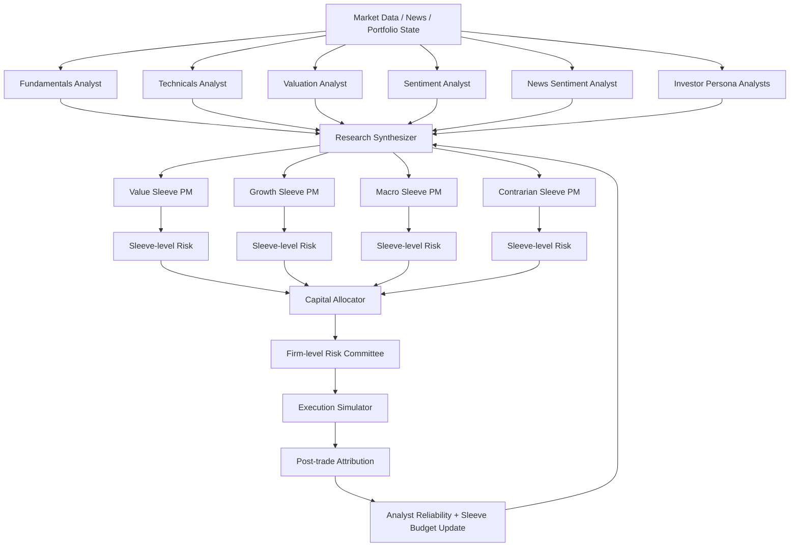

# AI Hedge Fund Common

> **Status: Currently under construction.**  
> This repository is being rebuilt from a multi-agent AI trading demo into an evidence-first, research-and-decision-support workspace for investment research simulation.

AI Hedge Fund Common is an extension and product redesign inspired by [`virattt/ai-hedge-fund`](https://github.com/virattt/ai-hedge-fund). The original project explores how multiple AI agents can analyze stocks and generate trading signals. This repository takes that idea in a more research-oriented direction: instead of asking AI agents to directly produce a final buy/sell/hold answer, the system is being redesigned to help users structure evidence, compare investment viewpoints, review risk, simulate allocation, and generate auditable research memos.

The goal is not to build an autonomous trading bot. The goal is to build an **AI investment research simulation workspace** that makes multi-agent analysis more explainable, governable, and reviewable.

---

## Project Vision

Most AI hedge fund demos are compelling because they combine:

- multiple investor-style agents,
- fundamental, valuation, sentiment, and technical analysis,
- risk management logic,
- portfolio management decisions,
- backtesting or simulation workflows.

However, a realistic research workflow needs more than a final trading signal. A research user needs to understand:

- what evidence supports each conclusion,
- which agents agree or disagree,
- how different investment styles interpret the same evidence,
- whether a proposal fits current risk constraints,
- how simulated decisions performed after the fact,
- whether the system can produce a reusable investment memo.

This project is therefore being redesigned from a **signal generator** into a **research-to-governance workflow**.

---

## Product Direction

The target product is an **AI investment research simulation workbench** for researchers, PM assistants, research engineers, and independent builders exploring agentic investment workflows.

The intended workflow is:

```text
Market Data / News / Portfolio State
        ↓
Analyst Agents
        ↓
Research Synthesizer
        ↓
Style Sleeve PMs
        ↓
Sleeve-level Risk
        ↓
Capital Allocator
        ↓
Firm-level Risk Committee
        ↓
Execution Simulator
        ↓
Post-trade Attribution
```

In other words, the system is being redesigned around this loop:

```text
Evidence → Proposal → Allocation → Risk Review → Simulation → Attribution → Memo
```

---

## Target Architecture



---

## Core Concepts

### 1. Evidence First

Agents should not immediately collapse their work into a final trading action. They should first produce structured evidence that can be reviewed, filtered, traced, and reused.

Example evidence object:

```json
{
  "evidence_id": "EV-NVDA-001",
  "ticker": "NVDA",
  "agent_name": "fundamentals_analyst",
  "evidence_type": "fundamental",
  "signal": "bullish",
  "confidence": 0.82,
  "horizon": "medium",
  "summary": "Revenue growth remains strong while margin expansion continues.",
  "risk_flags": ["high_valuation", "crowded_trade"],
  "source_refs": ["fundamentals", "news", "market_data"]
}
```

### 2. From Single PM to Style Sleeve PMs (or Investors)

Rather than sending all analyst outputs into one portfolio manager, the redesigned workflow introduces multiple style-based proposal agents:

- Value Sleeve PM
- Growth Sleeve PM
- Macro Sleeve PM
- Contrarian Sleeve PM

Each sleeve reviews the same evidence pool and produces its own proposal. This lets users compare how different investment styles interpret the same facts.

### 3. Two-layer Risk

Risk review is split into two levels:

```text
Sleeve-level Risk(pending):
Checks whether a proposal is appropriate inside a specific style sleeve.

Firm-level Risk:
Checks whether the combined proposals fit the overall simulated portfolio risk envelope.
```

This makes risk management more visible, explainable, and auditable.

### 4. Attribution Native (Later construction)

The system should record what happened after each simulated proposal:

- which analyst signals were reliable,
- which sleeve proposals performed well,
- which risk flags became real issues,
- whether capital allocation decisions were effective,
- whether vetoed or scaled proposals would have helped or hurt.

### 5. Human Governed

This project is designed for research support and simulation. Final outputs should be treated as:

```text
Research Support / Simulation Only / Human Review Required
```

---

## Planned Modules

### Research Synthesizer

A layer that normalizes raw analyst outputs into a consistent evidence schema and generates bull cases, bear cases, key risks, and areas of disagreement.

### Sleeve Proposal Panel

A comparison view where Value, Growth, Macro, and Contrarian sleeves generate separate proposals based on the same evidence set.

### Two-layer Risk Cockpit(start with one-layer first)

A governance view for sleeve-level and firm-level risk checks, including exposure limits, concentration, liquidity, crowding, and reason logs for approve / scale / block decisions.

### Capital Allocator

A simulated allocation engine that scores sleeve proposals based on expected edge, confidence, analyst reliability, diversification, drawdown, and crowding penalties.

### Execution Simulator

A paper execution layer that converts approved proposals into simulated orders and updates a paper portfolio state. No real brokerage connection is planned for the MVP.

### Attribution Dashboard(Save for later work)

A post-simulation review dashboard for analyst reliability, sleeve scorecards, proposal outcomes, risk flag outcomes, and allocation review.

### Report Builder

A memo builder that exports the research workflow into Markdown or PDF, including evidence, proposals, risk decisions, allocation recommendations, and final notes.

---

## Current Status

This repository is **currently under construction**.

New Arch Planned build sequence:

- [x] Product case study and redesign direction
- [x] Evidence schema
- [x] Analyst output normalizer
- [x] Research Synthesizer
- [x] Sleeve Proposal Panel
- [ ] Sleeve-level Risk (skip for now)
- [x] Firm-level Risk Cockpit
- [ ] Capital Allocator
- [ ] Execution Simulator
- [ ] Backtesting Update
- [ ] Attribution Loop & Dashboard
- [ ] Report Builder
- [ ] Updated CLI / setup documentation

---

## Repository Scope

### This project is

- an opc project,
- a multi-agent equity research workflow prototype,
- a redesign of an AI hedge fund demo,
- a paper portfolio governance prototype,
- a tool for exploring explainable AI-assisted research workflows.

---

## How to Run

Setup and run instructions are being updated as the project is rebuilt.

For now:

```bash
git clone https://github.com/yzha0/ai-hedge-fund-common.git
cd ai-hedge-fund-common
```

Detailed installation, environment variables, CLI commands, and demo workflows will be added once the MVP modules stabilize.

---

## Disclaimer

This project is for **self-research, education, and simulation purposes only**.

It does not provide investment advice, financial advice, or trading recommendations. It does not execute real trades. Any outputs produced by this project should be treated as experimental research artifacts that require human review.

---

## Credits

This project is inspired by and extends ideas from [`virattt/ai-hedge-fund`](https://github.com/virattt/ai-hedge-fund).

---

## License

This project is licensed under the MIT License. See the `LICENSE` file for details.
