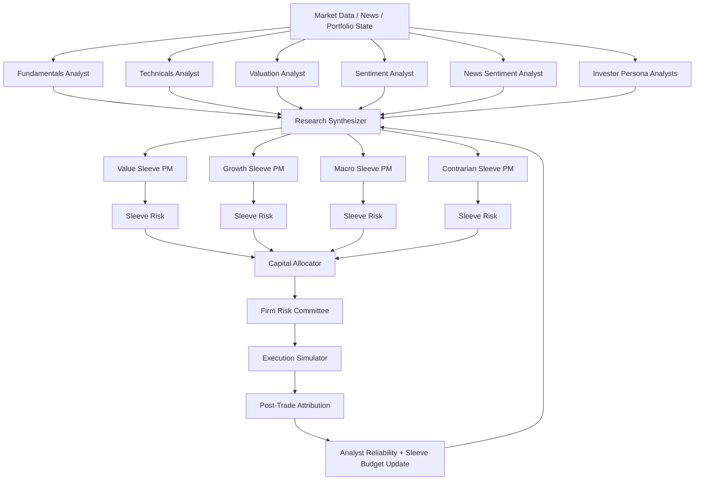
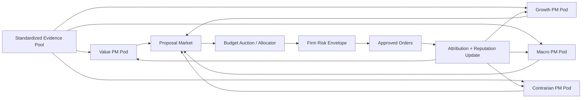
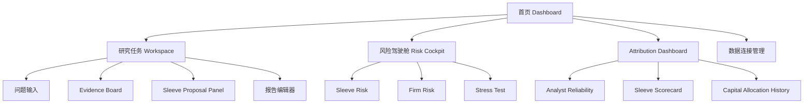
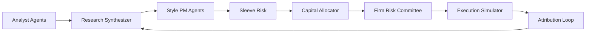

# ai-hedge-fund 优化推进与作品集重设计报告

## 执行摘要

Executive Summary：基于你补充的本地路径、模块名和上一轮 Codex 讨论，我将你的项目识别为与公开仓库 `virattt/ai-hedge-fund` 高度匹配的基线版本；如果你的本地分支已显著偏离 upstream，请把下文视为“公开基线诊断 + 你当前 WIP 的重设计方向”。截至 **2026-05-16**，该仓库公开页显示约 **58.8k stars、10.3k forks、45 个 issues、2 个 releases**，主语言为 **Python 62.3% / TypeScript 33.8%**，并包含 `src`、`app`、`tests`、`v2` 等目录。README 明确将项目定位为**教育/研究用途的 AI-powered hedge fund proof of concept**，提供 CLI、web app 和 backtester，但“不实际下单”。从公开代码可确认，当前核心 LangGraph 流程是 **`start_node -> selected analysts -> risk_management_agent -> portfolio_manager -> END`**；`portfolio_manager` 会把所有 analyst 输出压缩为每个 ticker 的 `{sig, conf}`，然后由单一 portfolio manager 统一做最终动作；`risk_manager` 已支持基于**波动率**和**相关性**的头寸上限，但仍是**单层集中式风控**。这意味着项目“很能演示”，但离“机构级投研产品”与“作品集里可讲清楚的 AI 投研 PM case”之间，仍差一个**组织级决策层 + 可解释产品层 + 作品集叙事层**。 

我对你的主张是：**不要把这个项目继续包装成“更复杂的自动交易器”**，而要把它重构并包装为一个**“证据优先的 AI 投研模拟工作台”**。技术上，最关键的升级不是再多加几个 analyst，而是引入你和 Codex 已经讨论到的那条演化路径：**Analyst 只产出标准化证据；Style PM 基于证据形成风格化提案；Capital Allocator 分配资本；Risk 拆为 sleeve-level 与 firm-level 两层；Post-trade attribution 再回流给 analyst 权重与 sleeve 预算**。产品上，把“单一 PM 拍板”改造为“分层治理 + 风险透明 + 证据可追溯 + 报告可导出”的研究工作流。这样既更像真实 buy-side 组织，也更容易包装成一个**AI 投研产品 PM**作品。相近的产品化路径，已经能在同作者的 `ai-financial-agent`、`Dexter`，以及更成熟的 OpenBB Workspace / FinRobot Pro 上看到：它们都把开源 agent 或数据能力，向上包装成研究助手、工作台或报告产品，而不是直接强调自动交易本身。

## 开源项目现状诊断

### 公开基线下的项目现状

从 README、目录结构和关键代码看，`ai-hedge-fund` 已经具备三个很强的优势。第一，**主题钩子很强**：项目把名人投资风格 agent、基本面/估值/情绪/技术面 agent 与风险管理、组合管理串成一个 AI hedge fund 叙事，天然有传播性。第二，**工作形态较完整**：仓库同时给出 CLI、web app、backtester、tests 目录、Poetry 依赖管理和截图式 README，公开社区可快速上手。第三，**LangGraph 结构足够清晰**：`src/main.py` 使用 `StateGraph(AgentState)` 组装 analyst、risk manager 与 portfolio manager，说明它不是“单 prompt 脚本”，而是具有显式 agent orchestration 的多节点系统。 citeturn30view0turn31view0turn34view0turn37view1turn39view0
但它也有三个明显瓶颈。第一，**决策层过早集中**：当前所有 analyst 节点都会直接连到同一个 `risk_management_agent`，后者再统一连到单一 `portfolio_manager`；而 `portfolio_manager` 对每个 ticker 只是收集 analyst 的 `{sig, conf}`，最终仍由单一 portfolio manager 做 one-shot action 选择，这会把上游差异压平成一个最终裁决。第二，**证据层没有独立建模**：`AgentState` 主要合并 `messages / data / metadata`，其中 `analyst_signals` 是字典堆积，而不是标准化的“研究证据对象”；因此系统难以支持 sleeve proposal、review、attribution 等更复杂的组织流程。第三，**风控虽有逻辑，但仍是单层**：当前 risk manager 已做基于 annualized volatility 与 correlation 的 position limit 调整，但目标是“给单一 portfolio manager 发 size constraint”，不是“先做 sleeve-level 限制，再做 firm-level 聚合审议”。 

## current workflow：
![[Pasted image 20260518163044.png]]

### 结构化评审表

| 维度    | 已确认现状                                                                                                                                                                    | 诊断结论                                   |
| ----- | ------------------------------------------------------------------------------------------------------------------------------------------------------------------------ | -------------------------------------- |
| 功能    | 包含 19 个左右 agent，覆盖名人风格、估值、情绪、基本面、技术面、risk manager、portfolio manager；支持 CLI、web app、backtester；README 明确“不实际下单”。                                                          | 功能丰富，主题强，但更像“多代理交易 PoC”，而非“投研产品”。      |
| 架构    | `create_workflow()` 把所有 selected analysts 接到 `risk_management_agent`，再接 `portfolio_manager`。                                                                             | 决策集中、治理层单一，适合 MVP，不适合机构化叙事。            |
| 技术栈   | Python 3.11、LangChain、LangGraph、Pandas、NumPy、FastAPI、Pydantic；仓库语言含 TypeScript。                                                                                          | 技术栈现代，便于继续产品化和 web 化。                  |
| 代码质量  | 有 Poetry、`pytest/black/isort/flake8` 开发依赖；目录整洁，结构清晰。                                                                                                                     | 已有工程雏形，但需要更强的测试、模块边界与安全策略。             |
| 文档    | README 覆盖安装、运行、截图、贡献方式、API key。                                                                                                                                          | 文档可读性不错，适合做“before/after 重写 README”展示。 |
| 测试    | 仓库存在 `tests/` 目录，`pyproject.toml` 有 `pytest` dev dependency。                                                                                                             | 测试基础可能存在，但目前缺少公开的质量指标与可见 CI 证明。        |
| CI/CD | 本轮公开证据无法确认 workflow 细节。                                                                                                                                                  | 作品集中应把“CI/CD 补齐”作为明显优化项。               |
| 依赖与许可 | MIT license；依赖多个 LLM provider 与外部金融数据 API；README 要求至少一个 LLM API key。                                                                                                     | 许可证清晰，但第三方依赖和数据耦合较深。                   |
| 安全    | 仓库 Security 页显示 **No security policy detected**，`Security and quality 0`；公开 issue 还出现“LLM API calls have no timeout”“please enable the security and quality modules”等反馈。 | 安全和运维硬化不足，正好是你作品集里最好讲的“工程成熟度升级点”。      |

表中“已确认现状”来自公开仓库页、源码原文、`pyproject.toml`、Security 页与公开 issues；其中 **tests 存在 ≠ 测试充分**、**有 Web App ≠ 产品化完成**，后者仍需你本地分支佐证。 citeturn30view0turn31view0turn34view0turn37view0turn37view1turn39view0turn38search3turn35search6turn38search6

### current key gap from demo workflow to product

如果你把这次 redesign 做成案例，我建议把“核心问题”明确写成下面这句话：

> **当前系统的问题不是 analyst 不够多，而是“证据—提案—分配—风控—复盘”之间没有被产品化为一个可解释的组织流程。**

这句话之所以站得住，是因为公开代码已经清楚显示：workflow 是 analyst 并联产出，risk manager 给 size limit，portfolio manager 读入 `signals_by_ticker` 和 `allowed actions` 后统一调用 LLM 生成最终动作。换言之，系统已经有“分析”和“限制”，但缺少中间那层“治理与分工”。而你提供的 Codex 讨论恰好补上了这层：Research Synthesizer、Style PM、Capital Allocator、两层 Risk、Attribution loop。这个方向不是“凭空发明新模块”，而是对现有架构的自然演化。 

### 工程与开源健康的基线

从工程治理角度，我建议你把下一轮优化明确对齐到一套公开、可辩护的基线：GitHub Actions 负责原生 CI/CD；Dependabot 负责依赖漏洞与版本更新；CodeQL 负责代码扫描；开源仓库必须有明确 license，而 SPDX 提供标准化 license identifier；OpenSSF Scorecard 明确把 **source code、build、dependencies、testing、project maintenance** 视为开源安全健康的关键维度；pytest 则是 Python 项目最常用的测试框架基础。现在的 repo 已经有 `pytest` 和 `tests` 起点，但缺的恰恰是把这些“局部工程实践”连成“可被评审者一眼看懂的工程成熟度故事”。 
## 用户、场景与架构选择

### 目标用户与使用场景

由于真实用户画像**未提供**，我建议你在作品集中采用一个对 AI 投研 PM 职位最友好的默认设定：**主用户是 buy-side 研究员 / PM 助理 / 研究工程师**，而不是面向散户的自动交易 bot 用户。原因很简单：当前仓库本身通过 README 把自己限定为教育/研究用途、非真实交易；而更成熟的同类产品化路径，如 `ai-financial-agent`、Dexter、OpenBB Workspace、FinRobot Pro，也都更强调**研究、分析、工作台、报告**，而不是“自动执行买卖指令”。这会让你的 case 从“炫技 agent demo”更自然地转向“高价值、低合规风险的研究产品”。 citeturn30view0turn38search7turn35search4turn22view0turn28view0

在这个假设下，项目的核心场景不应再是“让 19 个 agent 帮我买卖”，而应改写成三条连续工作流：

| 场景 | 用户目标 | 当前仓库覆盖度 | redesign 后应新增 |
|---|---|---|---|
| 研究启动 | 对某股票/主题形成多视角初判 | 高 | 结构化 evidence board、可信引用、任务拆解 |
| 多 sleeve 协同 | 不同投资风格形成可比较提案 | 低 | Research Synthesizer、Style PM 分层、proposal review |
| 投前/投后治理 | 在 firm 级约束下分配预算并复盘 | 低 | firm risk cockpit、capital allocator、attribution dashboard |

### 当前集中式、推荐分层式、以及去中心化方案的对比

你在 follow-up 里问到“能不能和 decentralized approach 比较”。我的结论是：**可以比较，但不建议把 fully decentralized 作为第一版作品集主线**。最适合你当前项目和目标岗位的是**分层 sleeve 模式**；decentralized 最好作为“Phase 2 实验设计”出现。原因是：分层 sleeve 模式既保留了多 agent 的丰富度，又更接近真实 buy-side 的组织设计；而 fully decentralized 模式虽然更“酷”，但在产品叙事、风险解释、验收标准和作品集可沟通性上都更难。这个判断也与 OpenBB、FinRobot 等产品化项目的共同特征一致：它们都优先把数据、agent、工作台、部署与治理分层，而不是让所有智能体无中心博弈。 citeturn22view0turn25view0turn27view0turn13view0turn23view11

| 模式 | 决策结构 | 优点 | 缺点 | 适合作品集吗 |
|---|---|---|---|---|
| 当前集中式 | Analysts → Single Risk → Single PM | 简单、易跑通、MVP 友好 | 单点瓶颈明显，组织感弱，final PM 黑箱化 | 适合做“before” |
| 分层 sleeve 模式 | Analysts → Synthesizer → Style PMs → Sleeve Risk → Capital Allocator → Firm Risk | 最像机构投研组织；解释性强；容易做 attribution | 实现复杂度中等 | **最适合做主线** |
| 去中心化模式 | Analysts / PMs 作为自治节点，通过投票、竞价或 auction 争夺预算 | 很新颖；便于做研究实验 | 风控、可解释性、UI、验收都更难 | 适合做“future work” |

### 推荐的重设计主图

下图综合了公开仓库的当前结构、你提供的 Codex 建议，以及我对作品集包装的取舍。它保留你现有的 analyst richness，但把“证据如何上升为组织决策”单独做出来。



这张图的价值不只是“看起来更专业”，而是它把你的系统从“一个有很多 analyst 的 trading demo”升级成“一个有 evidence、proposal、allocation、governance、attribution 的机构级 AI 投研 OS”。这种 story 对 AI 投研 PM 面试官的吸引力，通常会显著高于“我又加了几个 agent”。执行层你甚至不用真的接券商；继续保留 simulator / paper execution 反而更安全。公开 README 也强调该项目不实际交易，这正好给你“转向 research simulation product”的包装提供了依据。 citeturn30view0turn34view0turn36view0turn37view0

### 去中心化方案应该长什么样

如果你要把 decentralized approach 作为对照实验，我建议不要做“完全无中心化”，而做**受约束的去中心化资本市场**：每个 sleeve PM 都是自治 agent，提交自己的 *proposal packet*；capital allocator 不是“上帝 PM”，而是一个受 firm risk envelope 约束的**预算拍卖器**；firm-level risk committee 不决定谁对谁错，只决定哪些 proposals 违反 aggregate constraints，然后对预算做 haircut 或 veto。这样既保留 decentralized flavor，又不会失控。**去中心化/多主权架构**则更适合作为“高级探索”：每个 sleeve PM 视为一个拥有自身记忆、研究偏好、风险配额与资金目标的自治节点；它们各自生成 target book，不经由中央 PM 汇总，而是在共享 proposal bus 上公布意图；冲突通过共识/仲裁层解决，例如 Borda 排名、预算拍卖、可解释仲裁器、或带硬风控 veto 的治理投票。这个方案的亮点在于：你可以把它包装成“**AI 组织设计实验**”，展示你不是只会做 pipeline，而是在思考多智能体系统的治理模式；但它的难点也显而易见——回测更难、合规更难、责任归因更难、运维成本更高。




这个版本更像“内部 prediction market / capital market”而不是传统投委会。它的好处是能做更强的**budget competition**、**PM reputation** 和 **meta-learning**；坏处是 UI、解释性和风控展示都会更难。作品集里最好的写法不是“我一定要做 decentralized”，而是“**我比较了 centralized / hierarchical / decentralized 三种组织机制，最终先交付 hierarchical，decentralized 作为下一阶段实验轨道**”。这会显得你像一个会取舍的 PM，而不是只追求架构新奇性。 

### 竞品与参考案例对照

| 案例                           | 定位                                    | 公开信号                                                                           | 最值得借鉴的点                          | 不适合直接照搬的点                  |
| ---------------------------- | ------------------------------------- | ------------------------------------------------------------------------------ | -------------------------------- | -------------------------- |
| `virattt/ai-financial-agent` | 投资研究助手                                | 同作者、约 2k stars，明确是 investment research agent，并给出 live demo 叙事                  | 从“交易 PoC”转向“研究 agent + UI” 的包装方式 | 功能相对单体，不够组织化               |
| `virattt/dexter`             | 深度金融研究 agent                          | 强调 task planning、autonomous execution、self-validation、real-time financial data | 把复杂问题拆成研究计划，并加入自校验               | 更偏 deep research，少了投委会/预算层 |
| OpenBB                       | 数据平台 + Workspace + Marketplace        | Open source ODP + secure workspace + marketplace + enterprise deployment       | 数据层、工作台、agent、部署、商业化分层非常清晰       | 更偏平台型，学习成本高                |
| FinRobot / FinRobot Pro      | 金融 AI agent / equity research report  | 开源 agent 框架 + Pro 登录产品 + HTML/PDF report 生成                                    | “自动多页研究报告”非常适合作品集可视化展示           | 偏 equity research，组织治理层较弱  |
| Qlib                         | AI-oriented quant investment platform | 全链路量化研究平台，涵盖数据处理、训练、回测、优化、执行                                                   | 用“完整 research pipeline”讲系统性      | UX 不以 analyst-first 为核心    |
| AKShare + AKTools            | 中文数据接口层 / HTTP API                    | 中文数据覆盖强，AKTools 将 AKShare 快速 HTTP 化                                            | 很适合你做中国市场数据适配层                   | 它们是数据层，不是完整产品层             |

表中定位、星标、发布时间、许可与产品形态均来自各项目当前仓库页、官方产品页与论文/文档。一个非常值得你借鉴的模式是：**同作者已经在 `ai-hedge-fund` 之外，又做了更研究导向的 `ai-financial-agent` 与更 deep-research 导向的 Dexter**；这说明“从交易 PoC 向研究产品上行”本身就是合理方向，而不是你个人包装上的牵强转向。 citeturn38search7turn35search4turn7view3turn22view0turn27view0turn13view0turn28view0turn7view1turn23view12turn7view2turn13view1

## 重设计蓝图与实施路线

### 信息架构建议

如果你要把它放进作品集，我建议把“产品 IA”直接改成下面这种形式，而不是继续以 CLI 命令行展示为主。核心思想是：**证据流和治理流必须可视化**。



### 低保真草图

**研究工作台**

```text
┌──────────────────────────────────────────────────────────────────────┐
│ Logo   Workspace   Risk   Attribution   Reports   Settings          │
├───────────────┬───────────────────────────────┬──────────────────────┤
│ 左侧导航       │ 中央研究画布                  │ 右侧证据/约束面板       │
│ - Watchlist   │ [输入研究问题 / 选择ticker]    │ Evidence Board         │
│ - Tasks       │                               │ - 原始信号             │
│ - Sleeves     │ [Research Synthesizer 输出]    │ - 数据来源             │
│ - Reports     │                               │ - 时间戳 / 置信度      │
│               │ [Value / Growth / Macro /     │ Risk Constraints       │
│               │  Contrarian 四个 sleeve 卡片] │ - Sleeve cap           │
│               │                               │ - Firm net/gross       │
│               │ [生成 Proposal] [送审]         │ - Sector / factor cap  │
└───────────────┴───────────────────────────────┴──────────────────────┘
```

**资本分配与风控页**

```text
┌──────────────────────────────────────────────────────────────────────┐
│ Firm Risk Committee                                                  │
├──────────────────────┬───────────────────────────┬───────────────────┤
│ Sleeve Proposals     │ Capital Allocator         │ Approval Log       │
│ - Value: +12% budget │ score_value = 0.78        │ 10:12  haircut     │
│ - Growth: +18%       │ score_growth = 0.81       │ 10:13  approved    │
│ - Macro:  +08%       │ score_macro  = 0.54       │ 10:14  vetoed      │
│ - Contrarian: +10%   │ score_contra = 0.62       │                   │
│                      │                           │                   │
│ Exposure Overview    │ Risk Envelope             │ Export             │
│ - Gross / Net        │ - Beta cap                │ [PDF] [MD] [CSV]   │
│ - Sector heatmap     │ - Liquidity cap           │                   │
│ - Correlation map    │ - Crowding cap            │                   │
└──────────────────────┴───────────────────────────┴───────────────────┘
```

### 两层风险到底怎么工作

你问到“**Risk works in two layers: sleeve-level and firm-level**，firm-level risk committee 在这里怎么运作”。结合当前公开代码，我建议这样定义：

**sleeve-level risk** 负责回答：  
“**这个风格 PM 在自己的 mandate 内，能不能做这笔 trade？**”

它检查的是：
- 单名头寸上限
- sleeve 内总暴露
- sleeve 允许的风格偏离
- 单名波动率、止损、持仓期限
- 与 sleeve 现有 holdings 的相关性
- basic liquidity / slippage 约束

**firm-level risk committee** 负责回答：  
“**即使各 sleeve 都自洽，这些 proposal 合起来，整家公司能不能承受？**”

它检查的是：
- aggregate gross / net exposure
- factor / beta / sector / geography 集中度
- 跨 sleeve 相关性、crowding、流动性踩踏
- scenario / stress test
- 风险预算是否被某几个 sleeve 吃满
- 是否触发 kill switch、budget haircut 或 freeze

当前公开 `risk_management_agent` 已经具备一个很好的起点：它会拉价格、算年化波动率、算与 active positions 的平均相关性，再把这些转成 `remaining_position_limit`。这说明“**risk already exists**”，你要做的不是再发明风控，而是把它**从单层 size limit 代理，拆成 sleeve pre-check + firm aggregation cockpit**。

NIST AI RMF 强调应把 trustworthiness considerations 纳入 AI 产品的 design、development、use 和 evaluation；LangGraph 官方文档也把 human-in-the-loop、durable execution、debugging、production-ready deployment 作为核心能力。把这两点放在一起看，当前 repo 最欠缺的并不是“再加一个风险公式”，而是**把风控变成一个可审计、可打断、可升级的治理流程**。这正是你在本次 redesign 里最值得强调的产品价值。

| 层级 | 主要输入 | 核心职责 | 主要输出 | 建议频率 |
| --- | --- | --- | --- | --- |
| Sleeve-level Risk | 单个 sleeve 的 ideas、当前 sleeve book、标的波动率/相关性、行业暴露、流动性、成交成本、风格 mandate | 控制单一风格内部的名称集中度、风格漂移、换手、beta、流动性占比与单笔订单风险 | `sleeve_target_book`、`risk_flags`、`sleeve_budget_request`、`rejected_ideas` | 每次 proposal 生成时 |
| Firm-level Risk | 全部 sleeves 的 target books、当前 firm book、gross/net、因子暴露、压力测试、借券/流动性、drawdown、运营状态 | 统一把控跨 sleeve 相关性、总杠杆、净敞口、行业/单名集中度、组合层流动性与 kill switches | `approve / scale / block`、`global_limits`、`override_ticket`、`incident_log` | 每次 rebalance 前 + 盘中监控 |
| Risk Committee | Firm-level risk 汇总、例外项、审批策略、解释日志、负责人 | 把自动规则与人工覆核结合，形成真正可治理的审批链 | `final_approval`、`manual_override`、`postmortem` | Amber/Red 事件触发 |

在系统流程上，我建议把两层风控设计成下面这种“先局部、再全局、再裁决”的结构。它既保留自动化效率，也让人类可以在真正高风险时介入。


### capital allocator 的实现建议

capital allocator 我建议分三层推进，不要一开始就上复杂优化器。

#### 规则版 MVP

这是最适合放进作品集的 first shippable version。

```text
sleeve_score
= 0.30 * expected_edge
+ 0.20 * thesis_confidence
+ 0.15 * analyst_reliability
+ 0.15 * diversification_bonus
- 0.10 * recent_drawdown_penalty
- 0.10 * crowding_penalty

raw_budget = softmax(sleeve_score / temperature) * total_risk_budget
final_budget = apply_firm_caps(raw_budget)
```

这个版本的优点是：
- 可解释
- 好 demo
- 好写验收标准
- 能把 attribution 与 allocator 连起来

#### 约束优化版

当你进入第二版，可以把 allocator 升级为“**带约束的预算优化器**”：

**推荐目标函数** 可以分成 “收益、风险、成本、稳定性” 四类项：

$$
\max_{b, w}
\quad
\sum_{s \in sleeves} b_s \mu_s
-
\lambda_r \, w^\top \Sigma w
-
\lambda_t \, \|w - w_{t-1}\|_1
-
\lambda_c \, \text{Crowding}(w)
+
\lambda_d \, \text{Diversification}(b)
$$

其中：

- $b_s$：各 sleeve 的资本预算；
- $\mu_s$：各 sleeve 的预期 alpha 或 score；
- $w$：最终组合权重；
- $\Sigma$：组合协方差矩阵；
- $\|w-w_{t-1}\|_1$：换手成本代理项；
- `Crowding(w)`：拥挤度/借券/流动性惩罚；
- `Diversification(b)`：对预算分散度的奖励，可以用 entropy 或 risk parity 风格项近似。

**约束集合** 建议至少包括：

- 预算和约束：$\sum_s b_s \le 1$，且 $0 \le b_s \le b_s^{max}$；
- 组合和约束：gross、net、single-name、sector、factor、beta、liquidity participation；
- 执行约束：成交成本上限、可借券性、事件窗口限制；
- 治理约束：只有通过 sleeve risk 审批的 ideas 才能进入 allocator；
- 平滑约束：预算变动幅度与 turnover 上限，避免 budget thrash。

| 方法 | 适合阶段 | 优点 | 缺点 | 建议 |
| --- | --- | --- | --- | --- |
| 凸优化 / QP | v1 主方案 | 可解释、可控、易回测、约束表达清楚 | 需要较好风险/协方差与 score 标定 | **首选** |
| 启发式分配 | v1 fallback | 简单、鲁棒、实现快 | 目标函数表达弱，最优性差 | 用作降级模式 |
| 风险平价 / score 加权 | v1-v2 | 直观，适合早期演示 | 难表达复杂约束 | 可作为 baseline |
| RL / bandit allocator | v3 以后 | 可适应非线性与长期反馈 | 需要高质量仿真环境和严格治理 | 作品集里提到即可，不建议先做 |

**建议频率** 应该与研究 horizon 对齐，而不是“越高频越高级”。如果你主打投研产品 PM 方向，我建议这样写：Research Evidence 以日频为主、事件驱动为辅；Sleeve PM 每个开盘前产出 proposal；Allocator 在日频 rebalance 上运行，同时支持重大新闻触发的 intraday partial rebalance；Firm Risk 做 pre-trade 检查与盘中监控；Attribution 则按日归因、按周/双周更新 sleeve budget 与 analyst reliability。这样既能体现体系化，也更容易回测。

下面是一个建议的 **Allocator Request** 字段表，用于你后面把 API/前端/实验日志串起来。

#### 自适应在线版

第三版才考虑 contextual bandit / Thompson sampling，把不同 regime 下各 sleeve 的 hit rate 和 drawdown 反馈给 allocator。这能讲“自适应预算”，但不适合作为你第一次作品集交付的主战场。

### 关键流程图

把当前 flat flow 升级为“evidence → sleeve proposal → allocation → two-layer risk → attribution”后，关键流程应该长这样：



### 可执行优化建议总表

| 优化建议                                         | 维度           | 优先级 |  预估工作量 | 关键里程碑                                            | 交付物清单                                                                                      | 风险与缓解                                        | 验收标准与量化指标                                                                |
| -------------------------------------------- | ------------ | --: | -----: | ------------------------------------------------ | ------------------------------------------------------------------------------------------ | -------------------------------------------- | ------------------------------------------------------------------------ |
| 把产品定位从“AI hedge fund”改写为“AI 投研模拟工作台”         | 产品/商业化       |   高 | 2–3 人日 | 完成价值主张、用户画像、主场景收敛                                | One-liner 定位、PRD v0、重写 README 首屏文案                                                         | 风险是定位太保守；缓解方式是保留“hedge fund simulation”作为子标签 | 评审者能在 15 秒内理解产品对象、场景、边界                                                  |
| 引入 Research Synthesizer 与标准化 evidence schema | 数据/技术/可维护性   |   高 | 5–7 人日 | 定义统一字段并接入现有 analyst 输出                           | `signal/confidence/horizon/risk_flags/catalyst/evidence_source` schema、adapter 层、mock data | 风险是老 agent 输出格式不统一；先写 normalizer，再逐步替换       | 90% 以上 analyst 输出可落入统一 schema；关键结论 2 跳内可回源                               |
| 把单一 PM 改为 sleeve PM 架构                       | 产品/交互/技术     |   高 | 6–9 人日 | 完成 sleeve 分组、proposal UI、路由逻辑                    | Sleeve PM 节点、proposal card、review panel                                                    | 风险是状态复杂度上升；可先只做 4 个 sleeve                   | 从“单一最终决策”变为“多 sleeve proposal”；每个 proposal 都可解释                          |
| 设计两层风控与 firm risk cockpit                    | 安全/风控/可扩展性   |   高 | 6–8 人日 | 在现有 risk manager 上拆出 sleeve 与 firm 两层            | 风险面板、聚合约束模块、审计日志                                                                           | 风险是约束太多导致 demo 不流畅；先保留 5–7 个最关键约束            | 可展示 gross/net、factor、sector、liquidity、correlation 五类 firm 风险；每次 veto 有日志 |
| 实现 capital allocator 与 attribution loop      | 产品/技术/性能     |   高 | 5–8 人日 | 先做规则版预算器，再接 attribution                          | 预算打分器、allocation log、scorecard 页面                                                          | 风险是预算逻辑显得“拍脑袋”；用明确权重 + 配置文件缓解                | 可输出 sleeve budget、haircut、allocator reasoning；支持历史预算对比                   |
| 把 CLI/多 agent 过程产品化成 workspace + report      | 交互/可视化/作品集素材 |   高 | 5–7 人日 | 完成 research workspace、risk page、report page 中保真稿 | 首页、workspace、risk cockpit、report builder、导出模板                                              | 风险是 UI 工程量膨胀；优先做 3 个关键页面                     | 用户从输入问题到生成 proposal/report 的首个可见价值时间 < 90 秒                              |
| 补齐测试、CI/CD、安全与观测                             | 工程/可维护性/安全   |   高 | 4–6 人日 | 建立 smoke tests、CI、security baseline、trace/eval   | pytest、GitHub Actions、Dependabot、CodeQL、SECURITY.md、trace dashboard                        | 风险是 legacy 改造影响进度；先覆盖主流程                     | 核心路径测试覆盖 ≥ 70%；CI 成功率 ≥ 95%；关键依赖漏洞可见；AI 输出质量可监控                          |

这些建议的依据分别来自三类证据：一是当前 `ai-hedge-fund` 公开代码真实的集中式结构、单层 risk、单一 portfolio manager；二是同类产品/OpenBB/FinRobot/ai-financial-agent/Dexter 的产品化方式；三是工程与 LLM 质量基线（GitHub Actions、Dependabot、CodeQL、OpenSSF、Ragas、LangSmith、Phoenix。

### 视觉素材与演示视频脚本

| 素材 | 建议位置 | 你需要展示什么 |
|---|---|---|
| 原始仓库结构图 | “问题背景 / Before” | 现有 `analysts -> risk -> portfolio_manager` 的 flat flow |
| 新架构图 | “重设计方案” | Evidence、Sleeve PM、Allocator、Two-layer Risk、Attribution |
| Workspace 截图 | “核心界面” | 问题输入、evidence board、四类 sleeve proposals |
| 风险驾驶舱截图 | “风控治理” | sleeve risk 与 firm risk 的差别 |
| Capital Allocator 面板 | “系统智能” | 预算分配分数、haircut、批准日志 |
| Attribution dashboard | “闭环验证” | analyst reliability、sleeve scorecard、预算变更 |
| README before/after 对比 | “工程升级” | PoC README → 产品 README |
| 代码质量截图 | “可信度” | tests、CI、security、依赖治理 |
| 报告导出页 | “成果展示” | PDF / Markdown / investment memo 输出 |

演示视频建议控制在 **90–120 秒**，脚本按这个顺序走：
1. 一句话问题：当前多 agent 很炫，但最终决策过早集中。  
2. 展示旧流程图。  
3. 展示新流程图。  
4. 在 workspace 输入一个研究问题。  
5. 展示 evidence board。  
6. 展示四个 sleeve proposals。  
7. 打开 firm risk cockpit，说明为什么有 haircut / veto。  
8. 展示 capital allocator。  
9. 展示 attribution dashboard。  
10. 收尾：这不是自动下单器，而是证据优先的 AI 投研模拟工作台。

## 商业化、合规与作品集包装

### 商业化与产品化路径

如果你未来真的想把这个项目继续产品化，最现实的路线不是“直接做自动交易 SaaS”，而是分三层：

| 层级 | 产品形态 | 目标用户 | 盈利方式 |
|---|---|---|---|
| 开源层 | 多 agent engine + sleeve framework + simulator | 开发者、研究者、求职作品集用户 | 开源增长、社区贡献 |
| 专业用户层 | 本地 / BYO key 的 research workspace | 独立投资者、研究助理、顾问 | 订阅、模板、报告功能、协作功能 |
| 团队/机构层 | 私有部署 + 风控审计 + 数据连接 + 多用户协作 | family office、研究团队、小型 buy-side | seat license、私有部署、支持服务 |


### 市场与合规风险

这里我给你一个非常明确的建议：**作品集主叙事不要把它包装成自动投资建议系统，而要包装成研究与决策支持系统**。这不是“怂”，而是成熟。原因有三层。

第一，中国侧：`ai-hedge-fund` 这类多代理生成式系统如果公开向用户提供生成内容服务，会落在网信办《生成式人工智能服务管理暂行办法》的治理范围内；按 2025 年《人工智能生成合成内容标识办法》，文本、图片、音视频等 AI 生成内容要区分显式与隐式标识，2026 年网信部门也已经对未有效落实标识要求的平台作出处置。若未来服务对象是证券期货业机构，还要考虑证监会《证券期货业网络和信息安全管理办法》。 citeturn23view0turn23view1turn23view2turn17search2turn23view3

第二，美国侧：SEC 已在 2024 年对两家 investment advisers 因“虚假夸大 AI 使用方式”执法，这说明 **AI washing** 是真实监管风险；同时，SEC 对 robo-advisers 的 investor bulletin 和 Marketing Rule 也说明，一旦你把系统包装成自动化投资建议或 marketing communication，就会进入更敏感的监管语境。 citeturn23view4turn23view5turn23view6

第三，欧盟侧：AI Act 采用风险分层与透明度义务，欧盟官方说明还强调生成式 AI 内容应具备可识别性，相关透明度规则自 **2026 年 8 月** 起生效。若你将来面向跨境用户，这会影响产品文案、日志、标识和 disclosure 设计。

基于这些公开规则，我的**合规策略性推断**是：你最适合的 v1 定位是  
**“AI 投研模拟工作台 / 研究与决策支持系统 / paper portfolio governance product”**，  
而不是  
**“自动替用户决定买卖的交易系统”**。  
这种取舍既更容易进作品集，也更符合当前开源项目本身“research only, not intended for real trading”的边界。 

## 作品集故事线

你可以按下面这条故事线来写：

| 段落    | 你要讲什么                                                                          | 最重要的证明材料                                               |
| ----- | ------------------------------------------------------------------------------ | ------------------------------------------------------ |
| 背景    | 这是一个现象级开源 AI hedge fund 原型，但现有组织结构更偏 demo，而非研究产品                               | 仓库 stars、README、现有 workflow 图                          |
| 问题定义  | 所有信号太早收敛到单一 PM；证据层、治理层、复盘层都不独立                                                 | `create_workflow()`、`portfolio_manager`、`risk_manager` |
| 用户与场景 | 我要服务的不是“想让 AI 代替我炒股”的散户，而是研究员/PM 助理/研究工程师                                      | 用户流程图、信息架构                                             |
| 重设计   | 我把系统改成 Evidence → Sleeve PM → Two-layer Risk → Capital Allocator → Attribution | 新架构图 + 界面稿                                             |
| 实施    | 我不仅改信息架构，也补了测试、CI、安全与 eval                                                     | tests/CI/security/eval 截图                              |
| 结果    | 这个项目从“多 agent 交易 PoC”升级成“AI 投研治理工作台”                                           | demo 视频、导出报告、指标                                        |
| 反思    | 为什么 hierarchical 先于 decentralized；未来怎么做 allocator 自适应                          | roadmap                                                |
## 作品集呈现方式

### 推荐展示素材

| 素材                    | 放置位置          | 展示重点                                                    |
| --------------------- | ------------- | ------------------------------------------------------- |
| 原始 workflow 图         | 问题背景 / Before | `analysts -> risk -> single PM` 的 flat flow             |
| 新架构图                  | 重设计方案         | Evidence、Sleeve PM、Allocator、Two-layer Risk、Attribution |
| Workspace 截图          | 核心界面          | 问题输入、Evidence Board、四类 Sleeve Proposals                 |
| Risk Cockpit 截图       | 风控治理          | Sleeve risk 与 Firm risk 的区别                             |
| Capital Allocator 面板  | 系统智能          | 预算分配分数、haircut、批准日志                                     |
| Attribution Dashboard | 闭环验证          | analyst reliability、sleeve scorecard、预算变更               |
| Report Builder 页面     | 成果展示          | Markdown / PDF investment memo 输出                       |
| README before/after   | 工程与产品包装       | PoC README → 产品 README                                  |

###  Demo 视频脚本

建议控制在 90–120 秒：

1. 一句话问题：当前多 agent 很炫，但最终决策过早集中；
2. 展示旧流程图；
3. 展示新流程图；
4. 在 workspace 输入研究问题；
5. 展示 Evidence Board；
6. 展示四个 Sleeve Proposals；
7. 打开 Firm Risk Cockpit，说明 haircut / veto；
8. 展示 Capital Allocator；
9. 展示 Attribution Dashboard；
10. 收尾：这不是自动下单器，而是证据优先的 AI 投研模拟工作台。


## 作品集 Markdown 模板

下面这份模板按“**作品集成品**”来写，保留了你需要替换的占位符。你可以直接复制后，把 `[placeholder]` 替换为你的真实项目内容、截图和指标。

```md
# [项目名]
> 将一个开源多 Agent 交易原型，重设计为证据优先的 AI 投研模拟工作台。

## TL;DR
- **项目类型**：开源项目优化 + 产品重设计
- **我的角色**：[产品负责人 / 设计负责人 / PM + 工程 owner]
- **项目周期**：[例如 6 周]
- **目标用户**：[研究员 / PM 助理 / 研究工程师]
- **核心成果**：从 `analysts -> risk -> single PM` 的 flat flow，升级为 `evidence -> sleeve PM -> allocator -> two-layer risk -> attribution` 的组织级研究工作流
- **项目链接**：
  - GitHub Repo: [repo-url]
  - Demo: [demo-url]
  - Prototype: [figma-url]
  - Video: [video-url]

## 目录
- [项目背景](#项目背景)
- [问题定义](#问题定义)
- [现状诊断](#现状诊断)
- [用户与场景](#用户与场景)
- [重设计方案](#重设计方案)
- [架构与实现](#架构与实现)
- [结果与度量](#结果与度量)
- [商业化与风险](#商业化与风险)
- [反思](#反思)

## 项目背景
> 写作要点：
> - 说明项目原始形态是开源 PoC
> - 说明它为什么值得继续推进
> - 交代你的角色边界

示例文案：  
这个项目最初是一个开源的多 Agent 投资决策blueprint。它通过多位名人投资风格 agent、基本面/情绪/技术面 agent 共同分析股票，再由风险管理与组合管理模块输出交易建议。虽然它具备很强的话题性和演示效果，但我在审阅代码与工作流后发现，系统依然停留在“agent 很多，但组织治理很薄”的阶段。因此，我把这次优化的目标从“加更多 agent”转向“把它重构成一个更像真实 buy-side 研究团队的产品”。

## 问题定义
> 写作要点：
> - 用一句话定义最核心的问题
> - 避免泛泛地说“体验不好”
> - 最好有架构证据和用户价值证据

示例文案：  
当前系统的问题不是分析 agent 不够多，而是所有信号过早收敛到单一 Portfolio Manager，导致证据层、提案层、预算分配层、两层风控层和复盘层都没有独立产品化。结果是：系统能跑，但不够像一套可解释、可治理、可复盘的 AI 投研产品。

## 现状诊断
> 写作要点：
> - 从功能、架构、工程、风险四个角度讲
> - 先讲优点，再讲瓶颈
> - 给出结构图或表格

### 现有优点
- 多 agent 主题鲜明，传播性强
- 支持 CLI / Web / Backtester
- 已具备 LangGraph orchestration
- README 和目录结构较完整

### 现有瓶颈
- 单一 PM 决策层过于集中
- AI 输出缺少统一 evidence schema
- 风险管理只有单层，不支持 sleeve 与 firm 级治理
- 测试、CI、安全、可观测性故事不完整

## 用户与场景
> 写作要点：
> - 把目标用户从“泛用户”收敛成 1–2 类
> - 强调你选择“研究与治理”而不是“自动交易”的原因

### 目标用户
- **主要用户**：[研究员 / PM 助理]
- **次要用户**：[研究工程师 / 小型投研团队]

### 关键场景
1. 启动研究：对某个标的快速形成多视角初判
2. 多 sleeve 评审：不同风格 PM 形成可比较提案
3. firm 级治理：在 aggregate risk 约束下决定预算与批准
4. 复盘归因：根据结果更新 analyst reliability 与 sleeve budget

## 重设计方案
> 写作要点：
> - 一定要展示“旧结构 vs 新结构”
> - 明确你为何选择 hierarchical 而不是 fully decentralized
> - 给出 IA、流程图与界面图

### 新架构图


### 设计原则
- **Evidence First**：agent 先产出证据，再产出决策
- **Human Governed**：最终预算与审批有显式治理层
- **Risk by Design**：风控不是最后一道 if/else，而是双层治理
- **Attribution Native**：系统天生支持复盘与评分

### 关键页面
- Research Workspace
- Firm Risk Cockpit
- Capital Allocator
- Attribution Dashboard
- Report Builder

## 架构与实现
> 写作要点：
> - 不要只讲 UI，必须讲技术抽象
> - 用 schema、state、module boundary 说服技术评审

### 关键模块
- `research_synthesizer`
- `sleeve_pm_agents`
- `sleeve_risk`
- `firm_risk_committee`
- `capital_allocator`
- `attribution_engine`

### 统一证据 Schema
```json
{
  "ticker": "NVDA",
  "signal": "bullish",
  "confidence": 0.82,
  "horizon": "medium",
  "valuation_gap": 0.18,
  "catalyst_strength": 0.64,
  "risk_flags": ["crowded", "high_vol"],
  "evidence_sources": ["fundamentals", "news", "sentiment"]
}
```

### allocator v1 逻辑
```text
score = edge + confidence + diversification_bonus
        - drawdown_penalty - crowding_penalty

budget = softmax(score / temperature) * total_risk_budget
budget = apply_firm_caps(budget)
```

## 结果与度量
> 写作要点：
> - 把结果分为产品指标、工程指标、质量指标
> - 即使没有线上量，也要给出 demo/测试阶段指标

### 产品指标
- 从输入研究问题到拿到第一版 proposal 的时间：[xx 秒]
- proposal 可追溯率：[xx%]
- 报告导出成功率：[xx%]

### 工程指标
- 核心路径测试覆盖率：[xx%]
- CI 通过率：[xx%]
- 安全基线：[Dependabot / CodeQL / SECURITY.md 是否完成]

### LLM 质量指标
- Faithfulness：[xx]
- Context Precision：[xx]
- Latency P95：[xx]
- Cost per run：[xx]

## 商业化与风险
> 写作要点：
> - 明确产品边界
> - 说明为什么不直接做自动交易
> - 展示你理解合规与市场约束

### 产品定位
这是一个 **AI 投研模拟工作台**，而不是替用户自动下单的交易系统。

### 商业化方向
- Open-source core
- BYO-key Pro workspace
- Team / enterprise private deployment

### 风险
- 合规：AI 内容标识、投顾边界、营销表述
- 数据：第三方数据授权与质量
- 工程：依赖漏洞、超时、失败重试
- 信任：幻觉、不可解释、无法复盘

## 反思
> 写作要点：
> - 讲清取舍，而不是只讲“未来要做很多”
> - 重点讲你为何这样排序优先级

示例文案：  
这次 redesign 最重要的取舍，是没有继续追求“更多 agent”或“更复杂的全去中心化自治”，而是优先补上研究证据、组织治理和风控可解释层。因为对真实投研团队和产品面试官而言，系统是否可治理、可追溯、可复盘，往往比 agent 数量本身更重要。

## 附录
- GitHub Repo: [repo-url]
- PRD: [prd-link]
- Prototype: [figma-link]
- Demo Video: [video-link]
- Slides: [slides-link]
```

这份模板最重要的用法，不是原封不动照抄，而是拿它作为“**把开源项目讲成产品 case**”的骨架：**问题定义、结构重构、证据可追溯、治理逻辑、工程成熟度、商业化边界**。如果你真的按这个骨架补齐截图、流程图、架构图和度量指标，这会是一份非常像样、而且明显区别于一般 “我做了个 AI side project” 的 AI 投研产品 PM 作品集案例。