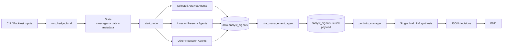
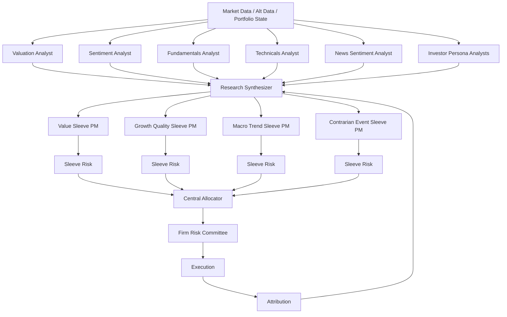
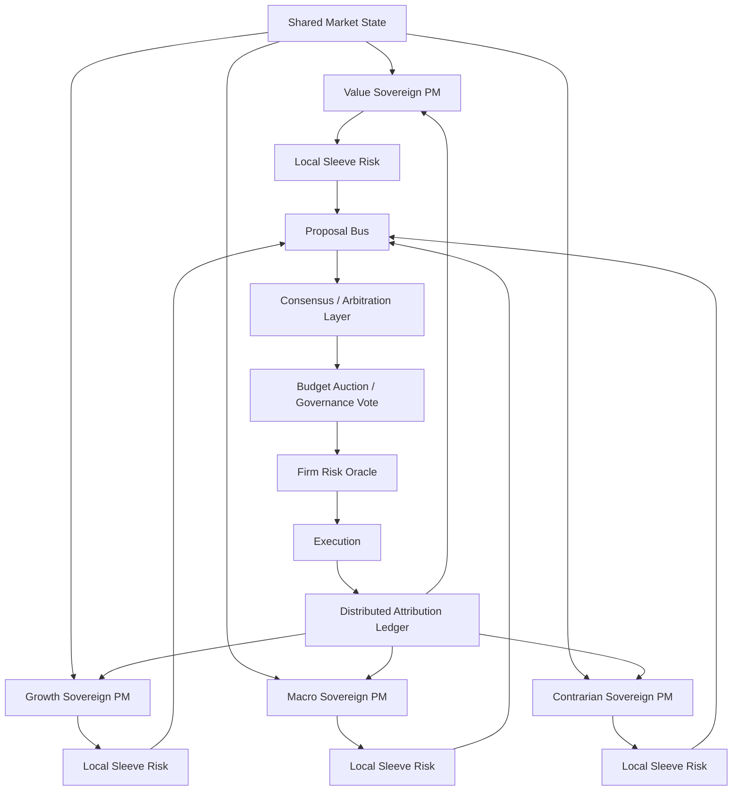
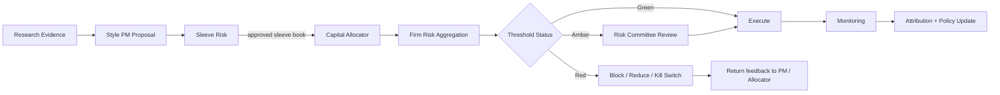
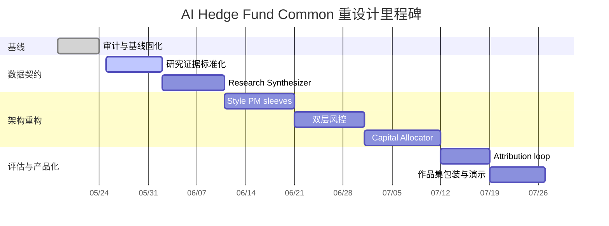

# AI Hedge Fund Common 仓库审阅与重设计报告

## 执行摘要

`yzha0/ai-hedge-fund-common` 当前更像一个**以 LangGraph 编排的多代理投研/交易决策原型**，而不是一个已经产品化的“AI 投研产品系统”。仓库 README 明确把项目定义为基于 `virattt/ai-hedge-fund` 的 extension project，目标是通过“organizational rebuild”和“better workflow”优化 AI 交易决策，但同时也标注了 **WIP**、**self research only**，并明确说明“the system does not actually make any trades now”。仓库结构则已经具备产品化外壳：根目录可见 `app/`、`docker/`、`src/`、`tests/`，`pyproject.toml` 也把 `src` 和 `app` 都声明为 package，并引入了 LangGraph、FastAPI、SQLAlchemy 等依赖。换句话说，项目已经有“产品壳”，但核心仍是一个代码优先、CLI 驱动的 agent workflow。citeturn43view0turn46view0turn30view0

从可执行主流程看，当前系统本质上是一个**固定工作流而非多主权自治系统**：`src/main.py` 用 `StateGraph` 构建 `start_node -> analysts fan-out -> risk_management_agent -> portfolio_manager -> END` 的有向图；初始状态只放入 `messages`、`data` 和 `metadata`，其中 `data["analyst_signals"]` 被当作共享状态池；最终输出由 `portfolio_manager` 一次性汇总所有非 risk agent 的信号，再结合 risk agent 产出的仓位限制和价格，做最后决策。这意味着：**研究、风险、交易在逻辑上被拆开了，但最终 trade-off 仍然集中在单个 Portfolio Manager 节点上**。citeturn8view1turn8view2turn9view0turn28view0turn28view1turn44view2

这个设计的最大问题，不在于“agent 不够多”，而在于**系统边界、资本分配边界、风险治理边界都还没成型**。当前 PM 只要求非 risk agent 提供每个 ticker 的 `signal` 与 `confidence`，说明上游研究输出契约仍是隐式的；risk agent 虽然已经计算了波动率、相关性和剩余仓位限制，但它仍是一个**单层、单节点**风险函数，而不是 sleeve-level 与 firm-level 两层风控；更关键的是，`compute_allowed_actions()` 对每个 ticker 独立基于同一份 `cash` / `margin` 计算可交易上限，缺少全局联合预算结算，因此存在“逐个合法、合起来超预算”的结构性风险。citeturn27view1turn27view2turn27view3turn28view0

如果你的目标是把这个项目包装成申请 **AI 投研产品 PM** 的作品集 case，我的建议是：**不要把它包装成“我做了很多投资大师 persona agent”**，而要包装成**“我审计了一个开源 agent trading demo，并把它重设计成一个可治理、可回测、可解释、可扩展的 AI 投研决策系统”**。其中，主叙事应该选择**中央化分层架构**，因为它更符合当前 repo 的技术现实，也更方便展示 PM 对“产品边界、系统治理、风控、实验设计”的把控；**去中心化/多主权架构**则作为高阶探索放到 appendix，展示你对组织设计与 agent autonomy 的深度思考。citeturn43view0turn8view2turn47view0turn44view0turn44view1

**假设边界**：以下方案默认数据源可扩展接入市场数据、替代数据与历史回测数据，部署既可本地也可云端；由于当前可公开成功抓取的源码以 `README.md`、目录树、`src/main.py`、`src/agents/risk_manager.py`、`src/agents/portfolio_manager.py`、`pyproject.toml` 与可见 `tests/` 目录为主，未直接展开的 analyst 子模块实现细节，以下仅依据目录清单与 PM 消费契约做保守判断。citeturn43view0turn46view1turn46view2turn28view0turn30view0turn46view3

## 仓库审阅

从目录结构看，仓库根目录包含 `app/`、`docker/`、`src/`、`tests/`、`README.md` 和 `pyproject.toml`；`src/` 下分为 `agents`、`backtesting`、`cli`、`data`、`graph`、`llm`、`tools`、`utils` 等子包，并显式存在 `src/main.py` 与 `src/backtester.py`。这说明你 fork 的版本已经不只是一个单文件 demo，而是朝“**agent orchestration + 回测 + 服务/API + UI**”的复合型项目演进。`pyproject.toml` 进一步佐证了这一点：一方面它引入 `langgraph`、多家模型 provider 的 LangChain 集成和 `pandas/numpy`，另一方面也引入了 `fastapi`、`sqlalchemy`、`alembic` 等面向产品化后端的依赖，并把 `src` 与 `app` 同时作为 package 暴露。citeturn46view0turn46view1turn30view0

| 路径 | 当前角色 | 你在报告里应如何定义它 |
| --- | --- | --- |
| `README.md` | 项目定位与团队叙事 | “项目愿景与组织设定说明书”，同时也是 doc-code drift 的对照基线 |
| `src/main.py` | 主入口、状态初始化、图编排 | “现有控制流主干” |
| `src/agents/` | 研究/投资人格/risk/PM 节点集合 | “现有 agent catalog” |
| `src/agents/risk_manager.py` | 波动率/相关性/仓位限制计算 | “单层 pre-trade risk node” |
| `src/agents/portfolio_manager.py` | 最终信号汇总与交易决策 | “单点最终决策器” |
| `pyproject.toml` | 依赖与运行脚本边界 | “技术栈与产品化表面” |
| `tests/` | 当前可见测试覆盖面 | “质量保障现状” |

`README.md` 定义了“Investor advisor team + Analyst Team + Governance + Execution”的整体叙事：投资顾问团队包括 Buffett、Graham、Ackman、Wood、Munger、Burry、Pabrai、Lynch、Fisher、Jhunjhunwala、Druckenmiller、Damodaran 等人格代理；分析团队包括 Valuation、Sentiment、Fundamentals、Technicals；治理层被写成“Risk Managers(committee)?”，执行层是 Portfolio Manager。不过，`src/agents/` 目录实际暴露的模块比 README 更多，除了这些人格与分析 agent，还出现了 `growth_agent.py`、`news_sentiment.py`、`nassim_taleb.py` 等文件。这是一个很值得写进作品集的发现：**架构已经演化，但文档叙事没有同步更新**。citeturn43view0turn46view2

当前可执行数据流和控制流，可以从 `src/main.py` 得到比较清楚的还原：`run_hedge_fund()` 先创建 workflow、编译 graph，并把 `tickers`、`portfolio`、`start_date`、`end_date`、空的 `analyst_signals`、以及模型元数据写入 state；`create_workflow()` 再把被选择的 analyst 节点全部从 `start_node` 扇出，随后统一汇入 `risk_management_agent`，再进入 `portfolio_manager` 并结束；主程序还会在 CLI 层构造带 `cash`、`margin_requirement`、`positions`、`realized_gains` 的 portfolio 数据结构。Graph 还支持用 `draw_mermaid_png()` 导出图，这一点对后续作品集包装非常有用。citeturn8view1turn8view2turn9view0

基于当前源码，可以把现有主流程概括成下面这张图。该图不是推测，而是对 `create_workflow()`、state 初始化字段以及 risk/PM 消费关系的压缩表达。citeturn8view1turn8view2turn27view2turn28view0



现有“信号合成与决策点”有三个关键事实。第一，`risk_management_agent` 并不是读取 analyst 观点后再约束，而是先自己拉取价格数据，对 `all_tickers = set(tickers) | positions.keys()` 逐个计算波动率、相关性、当前价格和剩余仓位限制，并把这些结果写回 `state["data"]["analyst_signals"][agent_id]`。第二，`portfolio_management_agent` 会把所有**非 risk agent** 的每 ticker 输出压缩成 `{sig, conf}`，再从 risk agent 结果中读取 `remaining_position_limit` 和 `current_price`，计算 `max_shares` 与 `allowed_actions`。第三，真正的买/卖/做空/回补/持有决策，是在 `generate_trading_decision()` 里通过**一次 LLM 调用**完成的；虽然“允许动作”和“最大数量”是确定性计算，但最终 trade-off 仍集中在单个节点。citeturn27view0turn27view1turn27view2turn28view0turn28view1

还要特别注意两个“作品集里非常能体现 PM 判断力”的源码事实。其一，PM 端已经使用了 Pydantic `PortfolioDecision` / `PortfolioManagerOutput` 来约束最终输出，但上游研究信号并没有统一的强类型 schema，这意味着**系统最关键的研究证据入口仍是隐式契约**。其二，README 说项目目标包含“self-improving module”，但主 graph 目前在 `portfolio_manager -> END` 结束，并未接入 attribution 或 agent reliability 更新回路。也就是说，这个 repo 的故事并不是“还差几个 agent”，而是“**缺一层真正的 operating system 设计**”。citeturn28view0turn48view2turn48view3turn43view0turn8view2

## 架构瓶颈与技术债

当前 repo 的主要问题，并不是功能做得少，而是**多个关键职责被混在了同一个 state 池和同一层决策里**。下面这张表把最值得写进 case study 的技术债，按“问题—为什么重要—证据”整理成了产品经理可叙述的形式。

| 类别 | 当前现状 | 为什么是问题 | 依据 |
| --- | --- | --- | --- |
| 单点最终决策 | 所有 analyst 最终汇入一个 `portfolio_manager`，再到 `END` | 决策解释、责任归属、风格预算、A/B 对比都被压缩到一个节点；无法自然呈现多 PM sleeve | `src/main.py` 的固定边 `analyst -> risk_management_agent -> portfolio_manager -> END`，以及 PM 对全部非 risk 信号的统一压缩消费。citeturn8view2turn28view0 |
| 数据契约隐式 | PM 只假定上游每 ticker 至少有 `signal` 和 `confidence`；risk agent 则把完全不同形态的 payload 也写进同一个 `analyst_signals` dict | 共享 dict 混装异构 payload，会让新增 agent、版本升级、测试替身和前后端联调都变脆弱 | `portfolio_manager` 明确读取 `signals[ticker].get("signal") / get("confidence")`；`risk_manager` 则写入 `remaining_position_limit`、`current_price`、`volatility_metrics`、`correlation_metrics` 等字段。citeturn28view0turn27view1turn27view2 |
| 联合预算缺失 | `compute_allowed_actions()` 对每个 ticker 独立用同一份 `cash` / `margin_used` 推导最大可买/可空数量 | 多 ticker 同时被选中时，容易出现“逐个合法、组合后超预算”的联合约束缺口 | `compute_allowed_actions()` 逐 ticker 读取同一份现金与保证金，并未做跨 ticker 联合最优化。citeturn28view0 |
| 风险层级不足 | 目前只有一个 `risk_management_agent`，做的是波动率与相关性调整后的 per-ticker limit | 没有 sleeve-level 与 firm-level 分层，缺少 gross/net、sector、drawdown、crowding、liquidity participation 的统一治理层 | README 只模糊写到 “Risk Managers(committee)?”，代码里则是单函数 `risk_management_agent`。citeturn43view0turn27view0turn27view1turn27view3 |
| 文档与代码漂移 | README 里 analyst team 只有四类，但 `src/agents/` 里还有 `growth_agent.py`、`news_sentiment.py`、`nassim_taleb.py` 等 | 这会削弱外部读者对系统边界的理解，也是作品集里可以体现“我做了架构盘点与叙事修复”的地方 | README 团队列表与 `src/agents/` 文件清单不一致。citeturn43view0turn46view2 |
| 自我改善回路缺位 | README 目标提到 organizational rebuild 和 self-improving module，但主图在 PM 后立即结束 | 没有 attribution、agent calibration、budget update，就无法形成真正的学习闭环 | README 目标与 `create_workflow()` 的 `portfolio_manager -> END` 形成对照。citeturn46view0turn43view0turn8view2 |
| 性能与 API 压力 | risk manager 对 `all_tickers` 顺序调用 `get_prices()`，逐个计算价格和波动率 | universe 扩大后会放大 I/O 延迟、API rate limit 与回测耗时 | `risk_manager` 中对每个 ticker 依次拉取数据并计算指标。citeturn27view0turn27view1 |
| 可测试性不足 | 公开可见的 `tests/` 目录里，当前明确露出的只有 `backtesting/`、`fixtures/api` 和 `test_api_rate_limiting.py` | 至少从目录可见性看，尚未呈现对 orchestration graph、allocator、risk policy、signal schema 的直接测试 | `tests/` 目录清单。citeturn46view3 |

如果把这些问题翻译成产品语言，核心其实是三句话。第一，当前 repo 已经有“多人协作”的表象，但还没有“**组织层面的 operating model**”；第二，当前 repo 已经有“风险计算”的实现，但还没有“**治理层面的裁决机制**”；第三，当前 repo 已经有“最终交易决策”的输出，但还没有“**预算分配层与 attribution 层**”。这三点，正好就是你把它重设计成 AI 投研产品案例的主线。citeturn43view0turn8view2turn27view2turn28view0

## 改进架构备选

LangGraph 官方文档把系统大致区分为两类：**workflow** 走预定义路径，**agents** 则更自治、更动态；同时它还明确给出 `orchestrator-worker`、`evaluator-optimizer` 等模式，并强调 persistence、human-in-the-loop、debugging 和 production-ready deployment。这非常适合拿来作为你重设计的理论支架：你现在的 repo 明显更接近 workflow，而你要展示的不是“再多加几个 LLM”，而是“**把一个固定 workflow 重做成有层级治理的投研系统**”。citeturn44view2turn44view3turn44view0turn44view1turn47view0

我建议把**中央化分层架构**作为主方案。原因很简单：它最贴合当前代码现实，也最利于把“研究、风险、资本分配、执行、归因”拆成功能明确的产品模块。具体做法是：Analysts 不再直接争抢最终交易指令，而是统一输出标准化研究证据；Research Synthesizer 负责把异构 evidence 归一成统一 schema；Style PMs 把研究证据翻译成风格化提案；Sleeve Risk 在风格层做约束；Central Allocator 在资本层做预算与排序；Firm Risk 在全局层做最终放行；Execution 负责订单落地；Attribution 反过来更新 analyst 权重与 sleeve 预算。这一设计与 LangGraph 的 orchestrator-worker / evaluator-optimizer 思路天然兼容，也和 NIST AI RMF 强调的 trustworthiness、design/development/use/evaluation 全生命周期治理更一致。citeturn44view0turn44view1turn41view0



**去中心化/多主权架构**则更适合作为“高级探索”：每个 sleeve PM 视为一个拥有自身记忆、研究偏好、风险配额与资金目标的自治节点；它们各自生成 target book，不经由中央 PM 汇总，而是在共享 proposal bus 上公布意图；冲突通过共识/仲裁层解决，例如 Borda 排名、预算拍卖、可解释仲裁器、或带硬风控 veto 的治理投票。这个方案的亮点在于：你可以把它包装成“**AI 组织设计实验**”，展示你不是只会做 pipeline，而是在思考多智能体系统的治理模式；但它的难点也显而易见——回测更难、合规更难、责任归因更难、运维成本更高。citeturn44view3turn44view0turn47view0turn41view0



| 维度 | 中央化分层架构 | 去中心化/多主权架构 | 结论 |
| --- | --- | --- | --- |
| 可实现性 | 高；最接近现有 `main -> risk -> PM` 的代码形态 | 中低；要新增 proposal bus、共识层、自治预算与复杂仿真 | **主方案选中央化** |
| 工程复杂度 | 中等；新增 schema、sleeves、allocator、firm risk 即可 | 高；状态同步、冲突解决、追责和 replay 都更复杂 | 去中心化适合 appendix |
| 可解释性 | 高；每层职责清晰，便于展示因果链 | 中；解释会被节点博弈和仲裁稀释 | 面试/作品集更偏好中央化 |
| 回测与仿真 | 相对容易；固定路径可做 baseline vs redesign | 难；需要模拟自治节点交互与共识成本 | 先做中央化可拿出硬结果 |
| 生产部署 | 更容易分层监控与逐步上线 | 部署与 observability 成本更高 | 中央化适合 MVP |
| 监管合规 | 更容易形成统一证据链、审批链和 override 日志 | 需要更复杂的责任边界与审计机制 | 中央化显著更强 |
| 组织实验价值 | 中 | 高 | 去中心化保留为思辨亮点 |
| 作品集叙事 | “我把 demo 重构成可治理系统” | “我探索 agent 组织设计边界” | **主叙事 + 附录叙事** 最佳 |

如果以“申请 AI 投研产品 PM”作为目标，我的明确建议是：**中央化分层架构做主 case，去中心化/多主权架构做对照实验或 appendix**。前者能展示你对可落地产品的判断，后者能展示你的战略视野与对 agent governance 的理解，两者组合起来，既不空泛，也不只是“写了点代码”。citeturn44view2turn44view3turn47view0turn41view0

## 风险两层设计

NIST AI RMF 强调应把 trustworthiness considerations 纳入 AI 产品的 design、development、use 和 evaluation；LangGraph 官方文档也把 human-in-the-loop、durable execution、debugging、production-ready deployment 作为核心能力。把这两点放在一起看，当前 repo 最欠缺的并不是“再加一个风险公式”，而是**把风控变成一个可审计、可打断、可升级的治理流程**。这正是你在本次 redesign 里最值得强调的产品价值。citeturn41view0turn47view0

| 层级 | 主要输入 | 核心职责 | 主要输出 | 建议频率 |
| --- | --- | --- | --- | --- |
| Sleeve-level Risk | 单个 sleeve 的 ideas、当前 sleeve book、标的波动率/相关性、行业暴露、流动性、成交成本、风格 mandate | 控制单一风格内部的名称集中度、风格漂移、换手、beta、流动性占比与单笔订单风险 | `sleeve_target_book`、`risk_flags`、`sleeve_budget_request`、`rejected_ideas` | 每次 proposal 生成时 |
| Firm-level Risk | 全部 sleeves 的 target books、当前 firm book、gross/net、因子暴露、压力测试、借券/流动性、drawdown、运营状态 | 统一把控跨 sleeve 相关性、总杠杆、净敞口、行业/单名集中度、组合层流动性与 kill switches | `approve / scale / block`、`global_limits`、`override_ticket`、`incident_log` | 每次 rebalance 前 + 盘中监控 |
| Risk Committee | Firm-level risk 汇总、例外项、审批策略、解释日志、负责人 | 把自动规则与人工覆核结合，形成真正可治理的审批链 | `final_approval`、`manual_override`、`postmortem` | Amber/Red 事件触发 |

在系统流程上，我建议把两层风控设计成下面这种“先局部、再全局、再裁决”的结构。它既保留自动化效率，也让人类可以在真正高风险时介入。citeturn47view0turn41view0



**Sleeve-level Risk** 的推荐职责，不是“替 PM 再做一遍判断”，而是把 PM 提案转换成**符合 mandate 的可执行 target book**。例如：Value sleeve 可以允许更慢的 holding period 和更高的单名权重上限，但不应该突然出现高换手、强事件驱动、纯新闻交易；Macro/Trend sleeve 可以接受更高 beta/更快切换，但需要更严格的 regime filter 与止损管理。换言之，sleeve risk 的本质是**风格一致性约束器**，而不是小号 firm risk。这个层里最重要的输入，是 `expected_alpha`、`predicted_vol`、`holding_horizon`、`liquidity_score`、`thesis_type`、`style_tag` 和当前 sleeve 账本。输出则应该是**规范化的 position proposal**，包括目标权重、风险消耗、成交成本和拒绝理由。  

```python
def sleeve_risk(proposal, sleeve_state, market_state, cfg):
    approved = []
    rejected = []

    for idea in proposal["ideas"]:
        max_by_name = cfg["max_name_weight"]
        max_by_liquidity = idea["adv20_capacity_weight"] * cfg["adv_participation_cap"]
        max_by_vol = cfg["target_name_risk"] / max(idea["predicted_vol"], cfg["vol_floor"])
        max_by_turnover = cfg["max_rebalance_turnover_weight"]

        cap = min(max_by_name, max_by_liquidity, max_by_vol, max_by_turnover)

        if idea["style_tag"] not in cfg["allowed_style_tags"]:
            rejected.append({"ticker": idea["ticker"], "reason": "style_drift"})
            continue

        if idea["risk_flags"].get("hard_block", False):
            rejected.append({"ticker": idea["ticker"], "reason": "hard_risk_flag"})
            continue

        approved.append({
            "ticker": idea["ticker"],
            "target_weight": min(idea["requested_weight"], cap),
            "risk_cost": min(1.0, idea["predicted_vol"] / cfg["target_name_risk"]),
            "reason_code": "approved_with_caps"
        })

    return {
        "sleeve_target_book": approved,
        "rejected_ideas": rejected,
        "requested_budget": sum(abs(x["target_weight"]) for x in approved)
    }
```

**Firm-level Risk** 则必须站在“整个公司资产负债表和合规责任”的角度工作。它的职责包括但不限于：组合级 gross/net 曝险、跨 sleeve 相关性、行业/单名集中度、流动性占比、借券难度、事件窗口风险、压力测试 PnL、组合 drawdown 以及模型/运营健康度。这里最关键的一点是：**firm-level risk 不关心哪一个 narrative 更对，它只关心整个系统是否在可承受范围内运行**。当前 repo 的 risk manager 已经有波动率与相关性函数，但它仍是 ticker 级 limit 计算；真正的 firm-level 风控要把所有 sleeve 提案和当前 firm book 聚合起来再作出最终裁决。citeturn27view1turn27view3

```python
def firm_risk_committee(sleeve_books, current_firm_book, constraints, market_state):
    proposed_book = aggregate_books(sleeve_books, current_firm_book)
    metrics = {
        "gross": calc_gross(proposed_book),
        "net": calc_net(proposed_book),
        "max_name": calc_max_name_weight(proposed_book),
        "max_sector": calc_max_sector_weight(proposed_book),
        "liq_usage": calc_adv_participation(proposed_book, market_state),
        "stress_1d": calc_stress_loss(proposed_book, market_state),
        "corr_cluster": calc_cluster_risk(proposed_book, market_state),
        "drawdown_guard": current_firm_book["rolling_drawdown"]
    }

    status = classify(metrics, constraints)  # green / amber / red

    if status == "green":
        return {"decision": "approve", "scale": 1.0, "metrics": metrics}

    if status == "amber":
        return {
            "decision": "review",
            "required_human_signoff": True,
            "suggested_actions": suggest_scales_or_hedges(metrics, constraints),
            "metrics": metrics,
        }

    return {
        "decision": "block",
        "required_human_signoff": True,
        "kill_switch_candidate": True,
        "metrics": metrics,
    }
```

我建议把 **Firm-level 风险委员会** 设计成一个明确的 **Green / Amber / Red** 流程，而不是一个模糊的“人工看看”。下面这张阈值表是**示例**，目的是给作品集呈现“规则化治理”的感觉，而不是声称这些阈值是行业标准。

| 监控指标 | Green | Amber | Red | 处理动作 |
| --- | --- | --- | --- | --- |
| Gross exposure | `<= 1.6x NAV` | `1.6x - 2.0x` | `> 2.0x` | Amber 进入委员会；Red 自动 block |
| Net exposure | `abs(net) <= 35%` | `35% - 50%` | `> 50%` | 需要降权或对冲 |
| 单名权重 | `<= 6%` | `6% - 8%` | `> 8%` | Red 阻断该 ticker |
| 行业集中度 | `<= 20%` | `20% - 25%` | `> 25%` | 需跨 sleeve 重新配额 |
| ADV 参与率 | `<= 10%` | `10% - 15%` | `> 15%` | 需拆单/延迟执行 |
| 一日压力损失 | `<= 1.5% NAV` | `1.5% - 2.5%` | `> 2.5%` | 触发 hedge 或降杠杆 |
| 滚动回撤 | `<= 5%` | `5% - 8%` | `> 8%` | Amber 冻结新增风险；Red 启动 risk-off |
| 模型/数据健康度 | 全部正常 | 部分降级 | 关键源失效 | 触发降级执行或停机 |

在运作方式上，委员会可以非常具体。**Green**：自动放行，只记录审计日志。**Amber**：系统自动生成“风险解释卡片”，由 PM Owner / Risk Owner / CIO 中至少两方会签；必要时允许 override，但必须保留 override reason、持续时间和回看责任人。**Red**：自动 block，并触发 kill switch 候选流程，仅允许在更高权限下手工恢复。这个设计既符合 NIST AI RMF 对 trustworthiness 与治理的强调，也契合 LangGraph 对 human-in-the-loop / interruptable workflow 的能力描述。

## Capital Allocator 设计

Capital Allocator 是你这次 redesign 里最“像产品经理在定义系统边界”的模块，因为它把“谁对”变成“**谁拿到多少预算**”。从方法上看，v1 最推荐走**凸优化/QP** 路线：CVXPY 官方示例明确说明 quadratic program 可以用来在金融场景里平衡期望收益与方差，并自然表达二次目标与仿射约束；与此同时，Pydantic 非常适合把 allocator 的 request/response 做成强类型 schema，再通过 `model_dump()` 和 `model_json_schema()` 生成前后端契约与实验日志格式。

**推荐目标函数** 可以分成 “收益、风险、成本、稳定性” 四类项：

$$
\max_{b, w}
\quad
\sum_{s \in sleeves} b_s \mu_s
-
\lambda_r \, w^\top \Sigma w
-
\lambda_t \, \|w - w_{t-1}\|_1
-
\lambda_c \, \text{Crowding}(w)
+
\lambda_d \, \text{Diversification}(b)
$$

其中：

- $b_s$：各 sleeve 的资本预算；
- $\mu_s$：各 sleeve 的预期 alpha 或 score；
- \(w\)：最终组合权重；
- \(\Sigma\)：组合协方差矩阵；
- \(\|w-w_{t-1}\|_1\)：换手成本代理项；
- `Crowding(w)`：拥挤度/借券/流动性惩罚；
- `Diversification(b)`：对预算分散度的奖励，可以用 entropy 或 risk parity 风格项近似。

**约束集合** 建议至少包括：

- 预算和约束：\(\sum_s b_s \le 1\)，且 \(0 \le b_s \le b_s^{max}\)；
- 组合和约束：gross、net、single-name、sector、factor、beta、liquidity participation；
- 执行约束：成交成本上限、可借券性、事件窗口限制；
- 治理约束：只有通过 sleeve risk 审批的 ideas 才能进入 allocator；
- 平滑约束：预算变动幅度与 turnover 上限，避免 budget thrash。

| 方法 | 适合阶段 | 优点 | 缺点 | 建议 |
| --- | --- | --- | --- | --- |
| 凸优化 / QP | v1 主方案 | 可解释、可控、易回测、约束表达清楚 | 需要较好风险/协方差与 score 标定 | **首选** |
| 启发式分配 | v1 fallback | 简单、鲁棒、实现快 | 目标函数表达弱，最优性差 | 用作降级模式 |
| 风险平价 / score 加权 | v1-v2 | 直观，适合早期演示 | 难表达复杂约束 | 可作为 baseline |
| RL / bandit allocator | v3 以后 | 可适应非线性与长期反馈 | 需要高质量仿真环境和严格治理 | 作品集里提到即可，不建议先做 |

**建议频率** 应该与研究 horizon 对齐，而不是“越高频越高级”。如果你主打投研产品 PM 方向，我建议这样写：Research Evidence 以日频为主、事件驱动为辅；Sleeve PM 每个开盘前产出 proposal；Allocator 在日频 rebalance 上运行，同时支持重大新闻触发的 intraday partial rebalance；Firm Risk 做 pre-trade 检查与盘中监控；Attribution 则按日归因、按周/双周更新 sleeve budget 与 analyst reliability。这样既能体现体系化，也更容易回测。

下面是一个建议的 **Allocator Request** 字段表，用于你后面把 API/前端/实验日志串起来。

| 字段 | 类型 | 必填 | 含义 | 示例 |
| --- | --- | --- | --- | --- |
| `run_id` | string | 是 | 一次完整决策 run 的唯一标识 | `"2026-05-16-preopen-001"` |
| `as_of` | string | 是 | 决策时间戳 | `"2026-05-16T08:25:00-07:00"` |
| `universe` | array[string] | 是 | 本次可交易标的集 | `["AAPL","MSFT","NVDA"]` |
| `current_book` | object | 是 | 当前 firm 组合与现金状态 | 见下方 schema |
| `sleeve_proposals` | array[object] | 是 | 各 sleeve 提交的 target book 与评分 | 见下方 schema |
| `risk_constraints` | object | 是 | gross/net/name/sector/liquidity 等硬约束 | `{"gross_max":1.6,"name_max":0.06}` |
| `covariance_ref` | string | 否 | 风险矩阵版本引用 | `"cov_v20260516_close"` |
| `regime_state` | object | 否 | 市场 regime / vol regime / event flags | `{"vol_regime":"high"}` |
| `allocator_config` | object | 是 | 目标函数权重、求解器、fallback 策略 | `{"solver":"cvxpy","lambda_risk":3.0}` |
| `approval_policy` | object | 是 | Green/Amber/Red 阈值与 override 规则 | `{"amber_requires":["risk","cio"]}` |

下面给出一个适合写进设计文档和作品集附录的 **JSON Schema 示例**。它不追求覆盖所有细节，而是体现“这次 redesign 把隐式契约变成了版本化接口”的思路。

```json
{
  "$schema": "https://json-schema.org/draft/2020-12/schema",
  "$id": "urn:ai-hedge-fund-common:allocator-request:v1",
  "title": "AllocatorRequest",
  "type": "object",
  "required": [
    "run_id",
    "as_of",
    "universe",
    "current_book",
    "sleeve_proposals",
    "risk_constraints",
    "allocator_config"
  ],
  "properties": {
    "run_id": {
      "type": "string"
    },
    "as_of": {
      "type": "string",
      "format": "date-time"
    },
    "universe": {
      "type": "array",
      "items": { "type": "string" }
    },
    "current_book": {
      "type": "object",
      "required": ["cash", "positions"],
      "properties": {
        "cash": { "type": "number" },
        "positions": {
          "type": "array",
          "items": {
            "type": "object",
            "required": ["ticker", "weight", "shares"],
            "properties": {
              "ticker": { "type": "string" },
              "weight": { "type": "number" },
              "shares": { "type": "integer" }
            }
          }
        }
      }
    },
    "sleeve_proposals": {
      "type": "array",
      "items": {
        "type": "object",
        "required": [
          "sleeve_id",
          "style",
          "score",
          "expected_alpha_bps",
          "predicted_vol",
          "ideas"
        ],
        "properties": {
          "sleeve_id": { "type": "string" },
          "style": { "type": "string" },
          "score": { "type": "number" },
          "expected_alpha_bps": { "type": "number" },
          "predicted_vol": { "type": "number" },
          "cvar95": { "type": "number" },
          "turnover_cost_bps": { "type": "number" },
          "ideas": {
            "type": "array",
            "items": {
              "type": "object",
              "required": ["ticker", "side", "target_weight", "confidence"],
              "properties": {
                "ticker": { "type": "string" },
                "side": { "type": "string", "enum": ["long", "short", "flat"] },
                "target_weight": { "type": "number" },
                "confidence": { "type": "number" },
                "source_refs": {
                  "type": "array",
                  "items": { "type": "string" }
                }
              }
            }
          }
        }
      }
    },
    "risk_constraints": {
      "type": "object",
      "required": ["gross_max", "net_abs_max", "name_max", "sector_max"],
      "properties": {
        "gross_max": { "type": "number" },
        "net_abs_max": { "type": "number" },
        "name_max": { "type": "number" },
        "sector_max": { "type": "number" },
        "adv_participation_max": { "type": "number" }
      }
    },
    "allocator_config": {
      "type": "object",
      "required": ["method", "solver"],
      "properties": {
        "method": { "type": "string", "enum": ["qp", "heuristic", "risk_parity", "rl_shadow"] },
        "solver": { "type": "string" },
        "lambda_risk": { "type": "number" },
        "lambda_turnover": { "type": "number" },
        "lambda_crowding": { "type": "number" }
      }
    }
  }
}
```

Allocator 的核心伪代码，可以写成下面这样。这样写的好处是：它既能和上面的 schema 对上，也能和你后续回测框架、前端展示、审计日志统一。

```python
def allocate(request):
    proposals = normalize_sleeve_scores(request["sleeve_proposals"])
    feasible = hard_filter(proposals, request["risk_constraints"])

    if request["allocator_config"]["method"] == "qp":
        result = solve_qp(
            feasible_proposals=feasible,
            current_book=request["current_book"],
            constraints=request["risk_constraints"],
            config=request["allocator_config"],
        )
    else:
        result = heuristic_allocate(
            feasible_proposals=feasible,
            current_book=request["current_book"],
            constraints=request["risk_constraints"],
        )

    result = post_process_rounding_and_lot_size(result)
    result = attach_risk_explanations(result)
    return result
```

**建议回测指标** 不要只放传统收益指标，而要体现你是 PM 视角在做系统评估。除了 CAGR、Annual Vol、Sharpe、Sortino、Max Drawdown、Calmar、Hit Rate、Turnover、Capacity、Slippage Sensitivity 之外，我建议把下面这些也列进去：

| 指标类别 | 关键指标 | 为什么重要 |
| --- | --- | --- |
| 收益表现 | CAGR、Sharpe、Sortino、Calmar | 与传统投资评估对齐 |
| 风险控制 | Max DD、Stress Loss、CVaR、Constraint Breach Rate | 展示治理有效性 |
| 执行质量 | Turnover、ADV Participation、Estimated Slippage | 展示“能不能真实执行” |
| 系统治理 | Override Rate、Amber/Red 事件数、模型降级次数 | 展示风控/委员会是否真在工作 |
| 研究质量 | Analyst Calibration、Evidence Coverage、Reasoning Completeness | 展示 AI 投研产品的 explainability |
| 分配质量 | Sleeve Budget Stability、Alpha Capture Rate、Capital Efficiency | 展示 allocator 是否有价值 |

## 路线图与作品集包装

这个项目最适合被包装成一个**“开源系统审计 + AI 投研产品重设计”**案例，而不是一个“我做了个会买卖股票的 agent”案例。原因很直接：README 已经把它定义为 WIP、self research only，且明确说明当前不实际交易；但与此同时，主流程、图可视化、回测入口、FastAPI/`app`/`docker` 等外壳又说明它非常适合被继续推进成一个“产品化系统”。这意味着你的作品集最该强调的，不是“收益率多高”，而是“**我如何把一个开源原型重构成一个更可信的 AI 投研决策产品**”。

下面是一条我认为**既可落地、又足够像 PM 作品**的路线图。工时基于“单人深度推进、同时兼顾设计文档与演示稿”的估算。

| 里程碑 | 主要交付物 | 估算工时 | 优先级 | 验证方式 |
| --- | --- | --- | --- | --- |
| 审计与基线固化 | 现状架构图、关键文件清单、问题列表、baseline 指标定义 | 12–16h | P0 | 结构审阅 + baseline replay |
| 研究证据标准化 | `ResearchEvidence` schema、Pydantic models、adapter 层、日志格式 | 18–24h | P0 | 单元测试 + schema 验证 |
| Research Synthesizer | evidence normalizer、source refs、quality score、risk flags | 20–28h | P0 | fixture replay + snapshot tests |
| Style PM sleeves | Value / Growth / Macro / Contrarian 四个 PM 子图 | 24–32h | P1 | graph integration tests |
| 双层风控 | sleeve risk、firm risk、Green/Amber/Red 审批链 | 24–30h | P1 | scenario tests + rule coverage |
| Capital Allocator | QP/heuristic allocator、request/response schema、审计日志 | 28–36h | P1 | backtest + constraint breach tests |
| Attribution loop | analyst reliability、sleeve scorecards、budget update 规则 | 16–24h | P2 | rolling replay + calibration tests |
| 产品化包装 | demo 脚本、图表、README redesign、作品集 case 文档、slide deck | 16–20h | P0 | mock interview rehearsal |



测试与验证策略，建议你直接按“**系统产品验证**”来写，而不是只写 pytest。这样更像 PM 作品，也更符合 LangGraph/NIST 对可观测、可治理系统的要求。citeturn47view0turn41view0

| 验证层 | 重点 | 通过标准 |
| --- | --- | --- |
| 单元测试 | schema、risk formulas、allocator constraints、rounding rules | 关键函数 deterministic 且边界值可重复 |
| 集成测试 | graph state 传递、节点路由、Amber/Red 打断流程 | 给定输入时图结构与审批路径稳定 |
| 回测评估 | baseline 单 PM vs 新中央化分层 | drawdown、constraint breach、budget stability 改善 |
| 模拟交易 | 缺失数据、API 失败、价格跳空、borrow unavailable | 系统能降级而非静默失败 |
| Shadow / A-B | 旧流程与新流程并行只出建议不下单 | 比较解释质量、风险事件与 allocator 稳定度 |
| 叙事验证 | mock 面试演示、5 分钟 demo、10 页 deck | 能在短时间讲清问题、方案、结果与取舍 |

最后是**作品集包装建议**。这里最关键的是叙事顺序。

| 包装模块   | 建议写法                                                                                                                  |
| ------ | --------------------------------------------------------------------------------------------------------------------- |
| 封面叙述   | **从 Persona-Based AI Hedge Fund Demo 到 Governed Multi-Sleeve Investment Operating System**                            |
| 问题陈述   | 开源 repo 有丰富的 agent 设定，但主流程仍是单中心决策；研究信号、风险、预算、执行与归因边界尚未成型                                                              |
| 你的角色   | 不是“写几个 agent”，而是“做系统审计、定义产品边界、设计治理机制、制定实验路线”                                                                          |
| 关键设计决策 | 标准化证据而非标准化 narrative；把“谁对”改成“谁拿预算”；把风控从单函数升级为双层治理                                                                     |
| 必备图表   | 现状架构图、重构后架构图、双层风控流程图、allocator 字段图、baseline vs redesign 的回测对比图、constraint breach 降低图、attribution scorecard            |
| 演示脚本   | 先讲“现状有什么问题”；再讲“我为什么选中央化分层作为主方案”；然后讲“双层风控 + allocator + attribution”；最后给出分阶段落地和 appendix 里的去中心化探索                      |
| 可交付清单  | 结构化设计文档、Mermaid 架构图、Pydantic/JSON Schema、risk policy 文档、allocator 接口文档、回测 notebook、测试报告、5–8 分钟 demo 视频、10–12 页 slides |

如果想让这个 case 在 PM 面试里更有“击中感”，我建议你在封面后第二页就放一句非常明确的话：**“我没有把这个开源项目继续堆成更多 persona，而是把它重新定义成一个可治理的 AI 投研决策系统。”** 这句话能立刻把你的角色从“会调 agent 的工程同学”拉升到“能定义产品与系统边界的 PM 候选人”。再结合当前 repo 已有的 graph 可视化能力、WIP 状态、回测入口和产品化依赖面，你会得到一个非常完整的作品集主 case。citeturn8view1turn43view0turn30view0